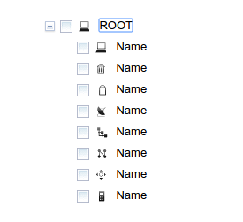

关于自定义Cbtree Icon，此文只讲实现，不讲原理：

官方文档如下： [https://github.com/pjekel/cbtree/wiki/Tree-Styling](https://github.com/pjekel/cbtree/wiki/Tree-Styling)

首先制作一个图标文件：


接下来编写css文件，比如我们的图标主题叫做`office`:

```css

.office {
    background-image: url('images/cbtree-icons.png'); /* Node icons sprite image */
    background-repeat: no-repeat;
    width: 18px;
    height: 18px;
    margin: 0;
    padding: 0;
}

.office.icon1 {
    background-position: -0px;
}

.office.icon2 {
    background-position: -18px;
}

.office.icon3 {
    background-position: -36px;
}
```

上面是`icon1`，`icon2`,`icon3`是每个图标的样式，**我们应该取一些有意义的名字**，这里只做示范用。

最后创建我们的Tree：

```coffee
tree = new Tree {
    model: model
    openOnClick: true
    valueToIconMap: {"icon": {"*": "* office"}}
}, dojo.byId('container')
```

可以浏览到效果：




---
END