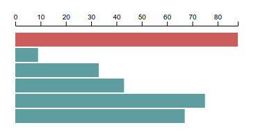

本节教程讲解坐标轴。

定义坐标：

```js
const axis = d3.axisTop(linear)
```

添加坐标：

```js
svg.append('g')
  .attr('transform', 'translate(0,30)')
  .call(axis)
```

样式：

```css
.axis path,
.axis line {
  fill: none;
  stroke: black;
  shape-rendering: crispEdges;
}

.axis text {
  font-family: sans-serif;
  font-size: 11px;
}
```

预览：



---
END