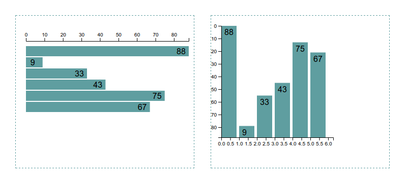

本节教程讲解添加文本。

```js
svg.selectAll('text.label')
  .data(dataset)
  .enter()
  .append('text')
  .attr('class', 'label')
  .attr('transform', 'translate(' + margin.left + ',' + margin.top + ')')
  .attr('x', function (d) {
    return linear(d) - 24 - margin.left// 留边
  })
  .attr('y', function (d, i) {
    return (i + 1) * 22 - 6
  })
  .text(function (d) {
    return d
  })
```

预览：



---
END