首先画一个渐进的背景：

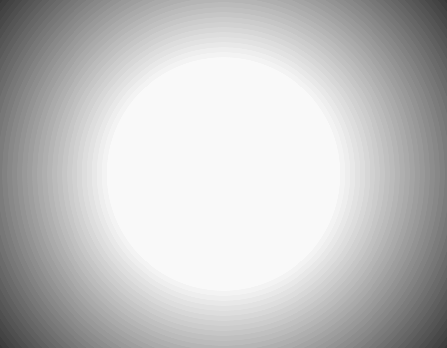

```java
void setup() {
  size(900, 700);
  colorMode(HSB);
  noLoop();
  noStroke();
}

void draw() {
  PGraphics bg = createGraphics(width, height);
  bg.beginDraw();
  bg.noStroke();
  float max = 1.5*width;
  float min = 0.5*width;
  for (float diam = max; diam > min; diam -=20) {
    bg.fill(map(diam, min, max, 255, 0 ));
    bg.ellipse(width/2, height/2, diam, diam);
  }
  bg.endDraw();
  image(bg, 0, 0);
}
```

调整背景颜色变得柔和一些，


```
bg.fill(map(diam, min, max, 255, 210 ));
```


接下来我们画树，树的画法是一个经典的分形算法。但是如果是完全的分形那么会显得不那么真实，比如下面：

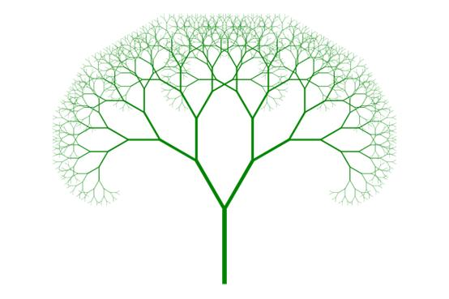

实际我们在画树的时候我们都会增加一些噪音让图画显得更自然。

具体的算法是，首先画一个树干，我们称之为`branch0`,`branch0`有如下一些属性：

- 位置`(x,y)`，一般是在画布的下底边中间，`x=width/2; y=height`。
- 长度`length`，表示树干的长度
- 粗细`size`，表示树干多粗
- 角度`theta`，树干是垂直的`-HALF_PI`

树干画好之后，使用递归来画树枝，每次分两个树枝出来，新的树枝长度和粗细都是原来的一半，一个
向左边偏，一个向右边偏，偏移的角度都是`PI/10`。

画树枝和树干的方法大致有两种：

一种是用一个线条表示，这种方法比较简单，但是缺少变化。同样也可以用长方形，梯形等形状表示；

另外一种是用一个一个的点/圆，堆积成一个树干/树枝，这种方法加入一些噪音到位置/粗细/角度颜色等
属性上面，可以更好的模拟树的形状。

下面展示一下算法：

```java
PGraphics tree;

void createTree() {
  tree=createGraphics(width, height);
  tree.beginDraw();
  tree.noStroke();
  tree.background(0, 0);
  tree.fill(60);
  branch( width/2, height, 70, -HALF_PI, 150, 0);
  tree.endDraw();
}
void branch(float x, float y, float size, float theta, float length, float pos) {
  float diam = lerp(size, 0.7*size, pos/length);
  tree.ellipse(x, y, diam, diam);

  float thetaChange=PI/10;
  if (size > 1) {
    if (pos<length) {
      x+=cos(theta+random(-PI/10, PI/10));
      y+=sin(theta+random(-PI/10, PI/10));
      branch(x, y, size, theta, length, pos+1);
    } else {
      boolean drawleftBranch= random(1)>0.1;
      boolean drawrightBranch=random(1)>0.1;

      if (drawleftBranch) branch(x, y, size/2, theta-thetaChange, length/2, 0);
      if (drawrightBranch) branch(x, y, size/2, theta+thetaChange, length/2, 0);
    }
  }
}

void draw() {
  image(bg, 0, 0);
  createTree();
  image(tree, 0, 0);
}
```


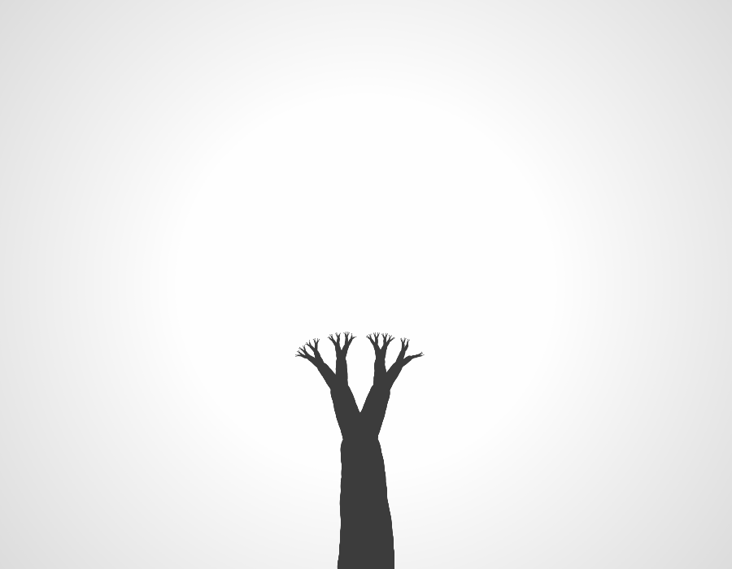
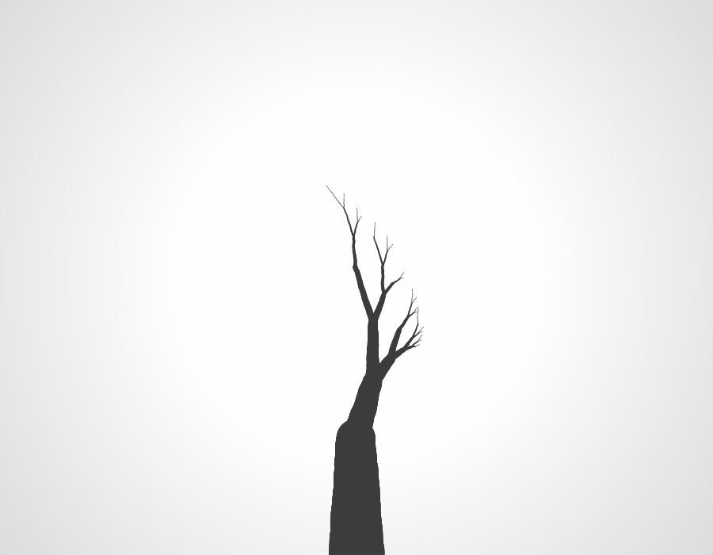
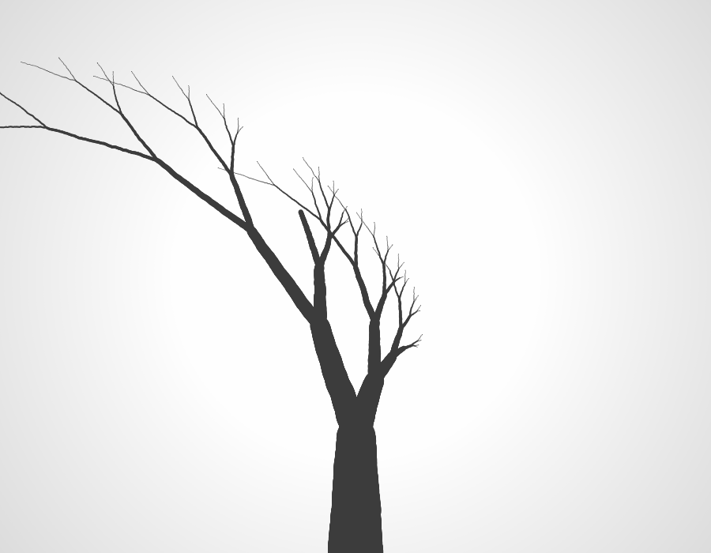
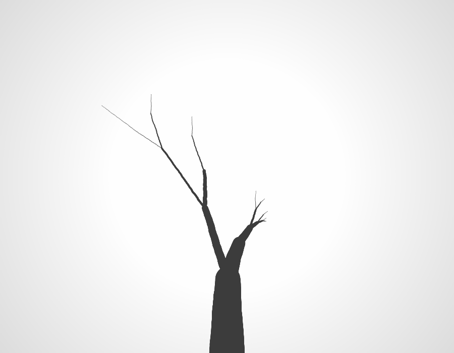
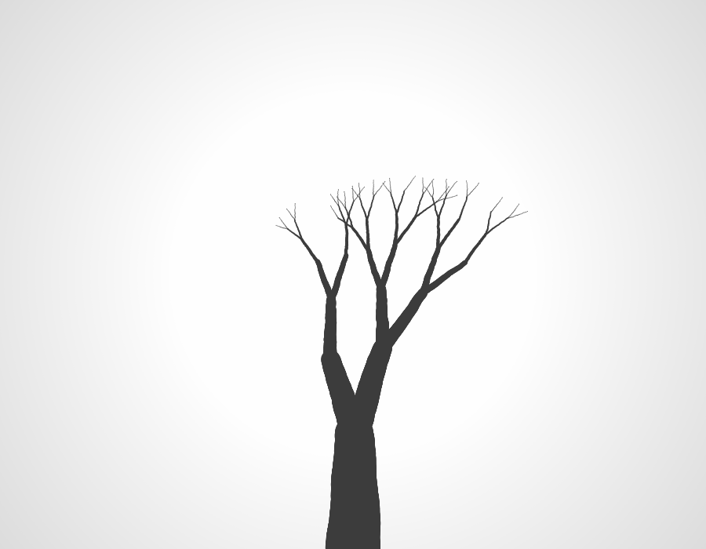
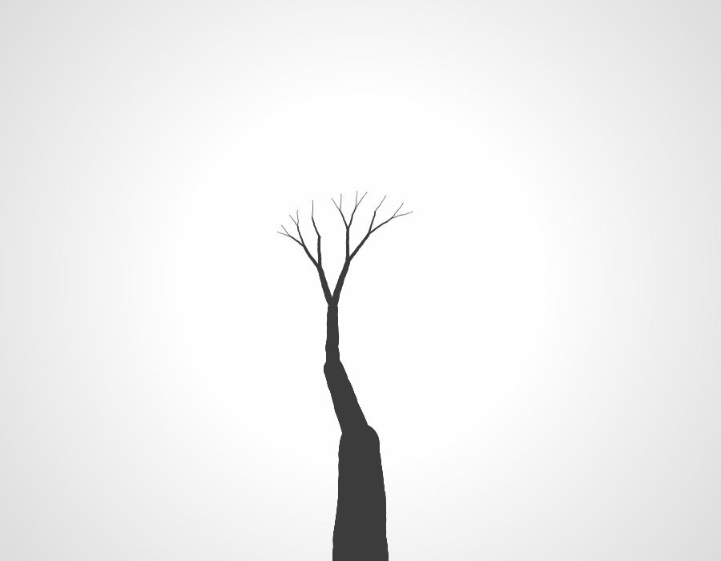
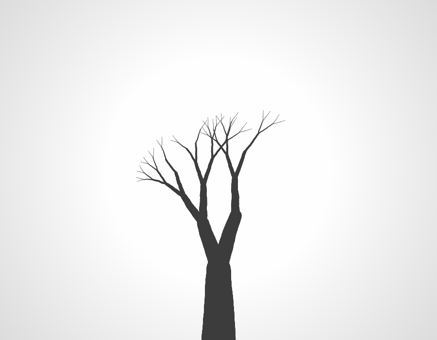
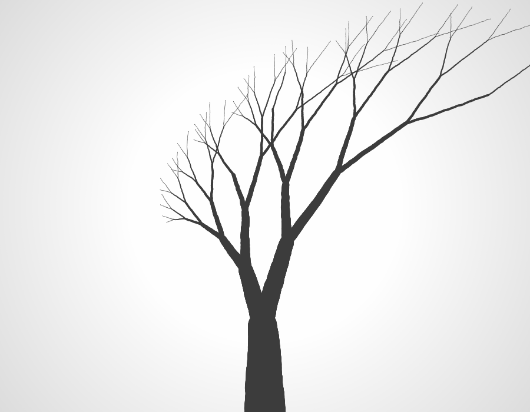
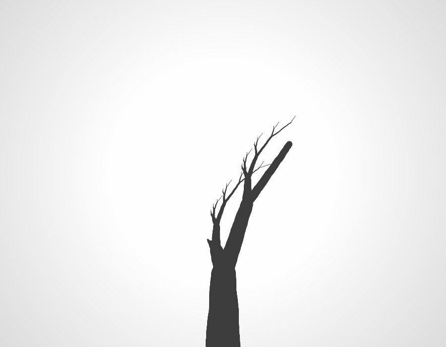
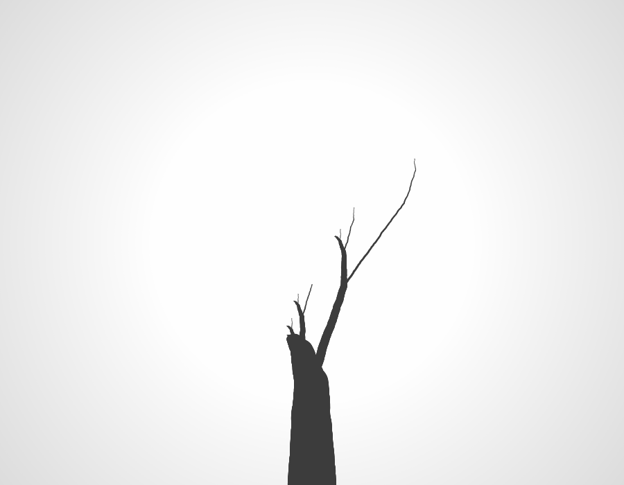
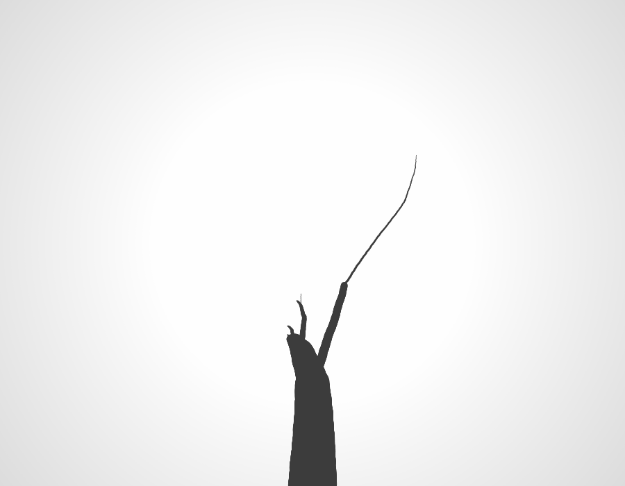
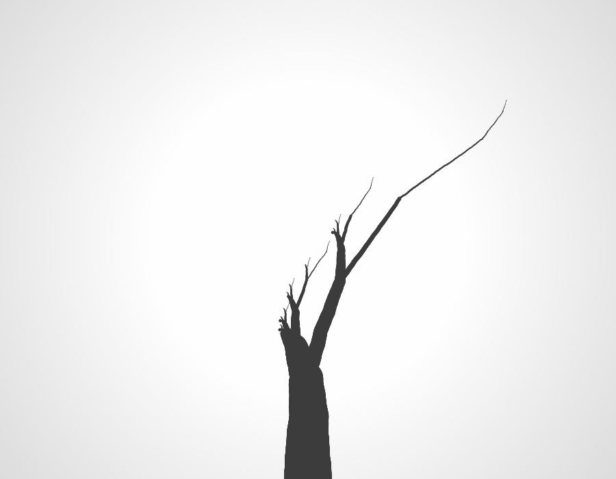
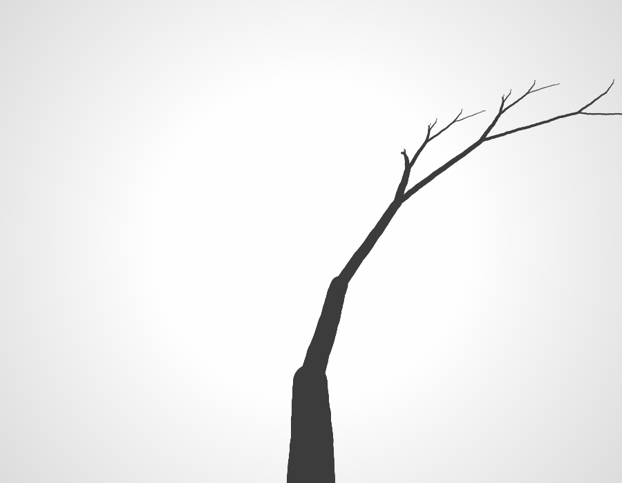
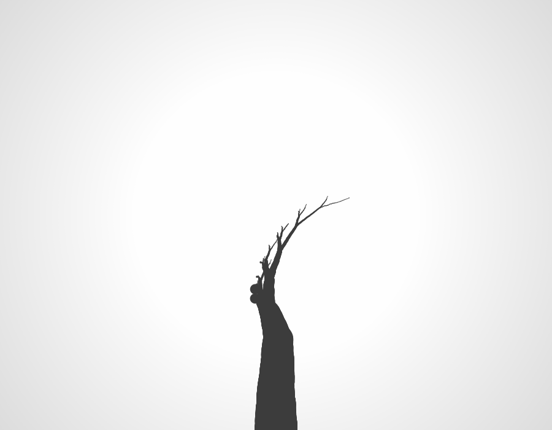
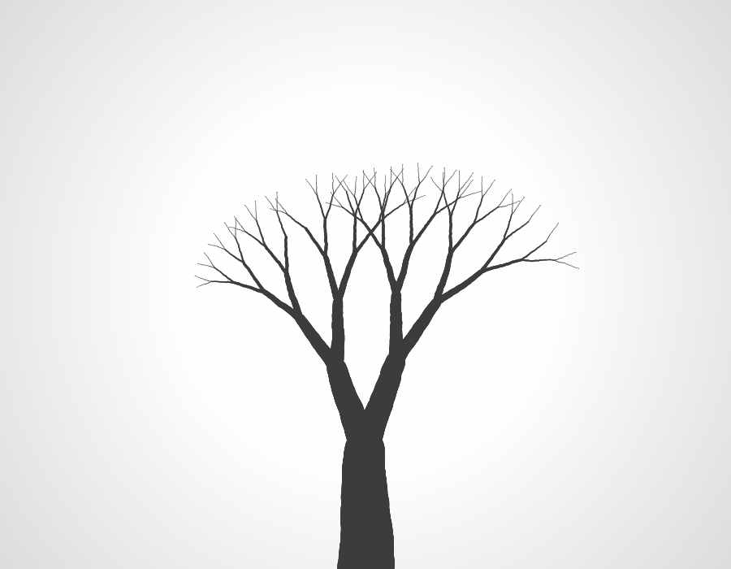

上面程序只加入了少许的随机，就能产生如此神奇的形状，而且我们看到，只要稍微调整一下参数就能生成各种各样的树。


---
未完。


---
END