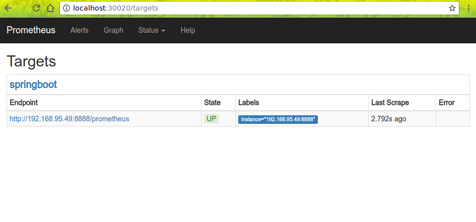

首先配置依赖：

## gradle.properties
```properties
prometheusVersion=0.0.21
```

## build.gradle
```groovy
    "io.prometheus:simpleclient_hotspot:${prometheusVersion}",
    "io.prometheus:simpleclient_servlet:${prometheusVersion}",
    "io.prometheus:simpleclient_pushgateway:${prometheusVersion}",
    "io.prometheus:simpleclient_spring_boot:${prometheusVersion}",
    "io.prometheus:simpleclient:${prometheusVersion}",
```

## Application.scala
```scala
@SpringBootApplication
@EnablePrometheusEndpoint
@EnableSpringBootMetricsCollector
class Application {

}

object Application extends App {
  SpringApplication.run(classOf[Application])
}
```

## 配置 Endpoint
```scala
import io.prometheus.client.exporter.MetricsServlet
import io.prometheus.client.hotspot.{MemoryPoolsExports, StandardExports}
import io.prometheus.client.{Collector, CollectorRegistry}
import org.springframework.boot.autoconfigure.condition.ConditionalOnMissingBean
import org.springframework.boot.web.servlet.ServletRegistrationBean
import org.springframework.context.annotation.{Bean, Configuration}

/**
  * @author 王成义
  * @version 5/15/17
  */
@Configuration
class PrometheusConfiguration {

  @Bean
  @ConditionalOnMissingBean
  def metricRegistry: CollectorRegistry = CollectorRegistry.defaultRegistry

  @Bean
  def registerPrometheusExporterServlet(metricRegistry: CollectorRegistry) =
    new ServletRegistrationBean(new MetricsServlet(metricRegistry), "/prometheus")

  case class ExporterRegister(collectors: List[Collector])

  @Bean def exporterRegister: ExporterRegister = {
    // StandardExport provides CPU usage metrics
    // MemoryPoolExports add memory usage by the JVM and host
    val collectors: List[Collector] = List(new StandardExports, new MemoryPoolsExports)
    new ExporterRegister(collectors)
  }

}
```

启动后访问 `http://localhost:8080/prometheus` 可以获得：

```
# HELP httpsessions_max httpsessions_max
# TYPE httpsessions_max gauge
httpsessions_max -1.0
# HELP httpsessions_active httpsessions_active
# TYPE httpsessions_active gauge
httpsessions_active 0.0
# HELP mem mem
# TYPE mem gauge
mem 479618.0
# HELP mem_free mem_free
# TYPE mem_free gauge
mem_free 261301.0
# HELP processors processors
# TYPE processors gauge
processors 8.0
# HELP instance_uptime instance_uptime
# TYPE instance_uptime gauge
...
```

## prometheus 配置
```yml
scrape_configs:
  - job_name: 'springboot'
    scrape_interval: 5s

    metrics_path: '/prometheus'
    static_configs:
      - targets: ['192.168.95.49:8888']
```

访问prometheus targets 节点可以看到：




---
END
