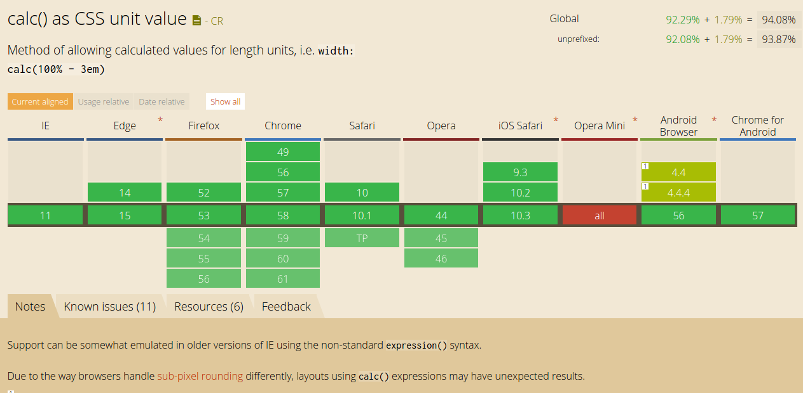
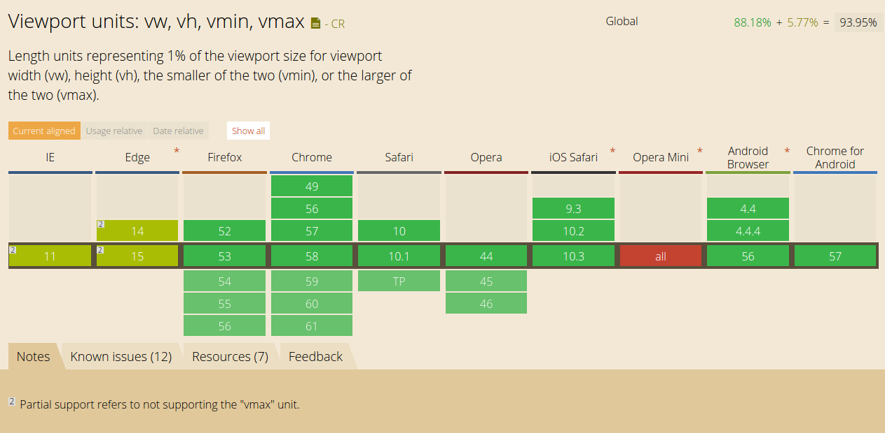

今天看`jsfiddle.net`的样式发现了两个好玩而的东西，可以来解决之前很麻烦的布局问题。

## calc
现在CSS可以直接使用`cala`来计算长度：

```
calc(100% - 3em)
calc(100vh - 200px)
```

浏览器支持如下：



[http://caniuse.com/#search=calc](http://caniuse.com/#search=calc)

## vh,vw
另外一个是`vh`和`vw`，来表示viewport的大小。



[http://caniuse.com/#search=vh](http://caniuse.com/#search=vh)

用这些属性可以简单的达到下面的布局：


```html
<header></header>
<div class="page-container">
  <div class="container-col sidebar"></div>
  <div class="container-col content"></div>
</div>
```

```stylus
  header {
    height: 100px
    width: 100vw
    background: rebeccapurple
  }

  .page-container {
    display: flex;
  }

  .container-col {
    height calc(100vh - 100px)
  }

  .sidebar {
    width 300px
    background: cornflowerblue
  }

  .content {
    width calc(100vw - 300px)
    background: cornsilk
  }
```

---
END
