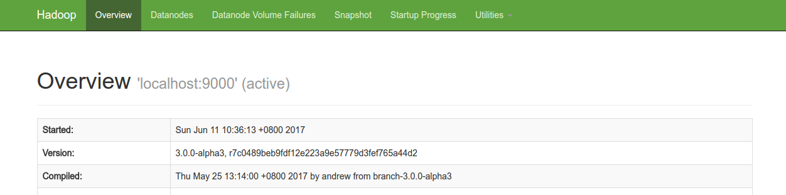
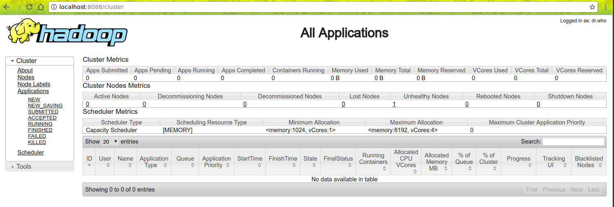

首先去[官网](http://hadoop.apache.org/releases.html)下载hadoop.本文书写时最新版为`3.0.0-alpha3`，
最新稳定版为`2.8.0`。

为了测试，我们只安装[单机版](http://hadoop.apache.org/docs/current/hadoop-project-dist/hadoop-common/SingleCluster.html)的hadoop。

## 环境
- Linux Mint 17
- JDK8
- SSH

## 下载
[地址](http://www.apache.org/dyn/closer.cgi/hadoop/common/)

## Java 环境变量
```shell
export JAVA_HOME=/usr/java/latest
```

## 启动
```shell
bin/hadoop
```

## 单机版操作
```shell
$ mkdir input
$ cp etc/hadoop/*.xml input
$ bin/hadoop jar share/hadoop/mapreduce/hadoop-mapreduce-examples-3.0.0-alpha3.jar grep input output 'dfs[a-z.]+'
$ cat output/*
```

## 伪分布式操作

### 配置

`etc/hadoop/core-site.xml`
```xml
<configuration>
    <property>
        <name>fs.defaultFS</name>
        <value>hdfs://localhost:9000</value>
    </property>
</configuration>
```

`etc/hadoop/hdfs-site.xml`
```xml
<configuration>
    <property>
        <name>dfs.replication</name>
        <value>1</value>
    </property>
</configuration>
```

### ssh 免密
安装，
```shell
$ sudo apt-get install ssh
$ sudo apt-get install pdsh
```

测试，
```shell
ssh localhost
```

如果需要输入密码，可以运行如下命令：
```shell
$ ssh-keygen -t rsa -P '' -f ~/.ssh/id_rsa
$ cat ~/.ssh/id_rsa.pub >> ~/.ssh/authorized_keys
$ chmod 0600 ~/.ssh/authorized_keys
```

### 运行
1. 格式化
```shell
bin/hdfs namenode -format
```

1. 启动`NameNode`和`DataNode`守护进程
```shell
sbin/start-dfs.sh
```
启动的时候报错：
```shell
pdsh@alan: localhost: rcmd: socket: Permission denied
Starting datanodes
pdsh@alan: localhost: rcmd: socket: Permission denied
Starting secondary namenodes [alan]
pdsh@alan: alan: rcmd: socket: Permission denied
```
编辑文件：
```shell
sudo vi /etc/pdsh/rcmd_default
```
输入`ssh`敲回车保存。再次运行`start-dfs.sh`即可：
```shell
Starting namenodes on [localhost]
Starting datanodes
Starting secondary namenodes [alan]
alan: Warning: Permanently added 'alan' (ECDSA) to the list of known hosts.
```

日志在`$HADOOP_LOG_DIR` 目录 (defaults to `$HADOOP_HOME/logs`)

1. 查看NameNode
```shell
http://localhost:9870/
```



1. 创建目录
```shell
$ bin/hdfs dfs -mkdir /user
$ bin/hdfs dfs -mkdir /user/<username>
```

1. 拷贝文件到HDFS
```shell
$ bin/hdfs dfs -mkdir input
$ bin/hdfs dfs -put etc/hadoop/*.xml input
```

1. 运行样例程序
```shell
$ bin/hadoop jar share/hadoop/mapreduce/hadoop-mapreduce-examples-3.0.0-alpha3.jar grep input output 'dfs[a-z.]+'
```

1. 拷贝output到本机，检查
```shell
$ bin/hdfs dfs -get output output
$ cat output/*
```
或者直接在hdfs上查看：
```shell
$ bin/hdfs dfs -cat output/*
```

1. 关闭守护进程
```shell
$ sbin/stop-dfs.sh
```

## 单节点YARN
1. 格式化并启动守护进程，然后创建目录

1. 配置
`etc/hadoop/mapred-site.xml`
```xml
<configuration>
    <property>
        <name>mapreduce.framework.name</name>
        <value>yarn</value>
    </property>
</configuration>
```

`etc/hadoop/yarn-site.xml`
```xml
<configuration>
    <property>
        <name>yarn.nodemanager.aux-services</name>
        <value>mapreduce_shuffle</value>
    </property>
    <property>
        <name>yarn.nodemanager.env-whitelist</name>
        <value>JAVA_HOME,HADOOP_COMMON_HOME,HADOOP_HDFS_HOME,HADOOP_CONF_DIR,CLASSPATH_PREPEND_DISTCACHE,HADOOP_YARN_HOME,HADOOP_MAPRED_HOME</value>
    </property>
</configuration>
```

1. 启动Yarn
```shell
$ sbin/start-yarn.sh
```


1. Resource Manager
```shell
http://localhost:8088/
```

1. 执行程序

1. 关闭
```shell
$ sbin/stop-yarn.sh
```

---
END
