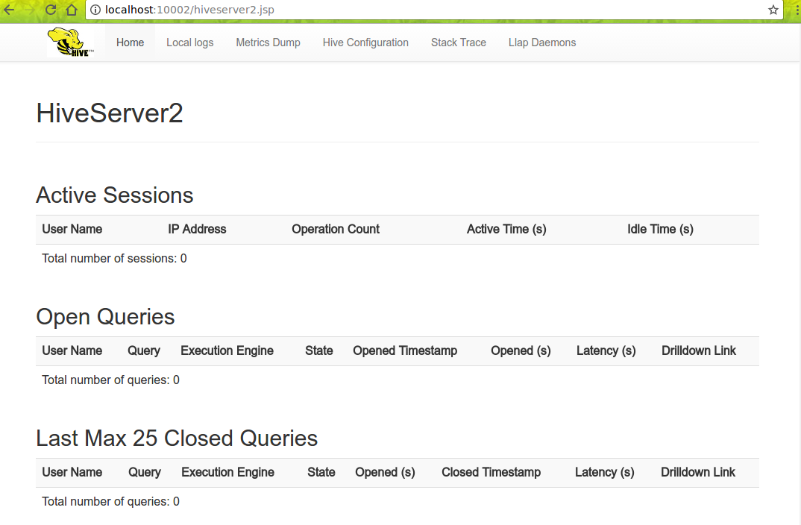

我们已经安装好了hadoop，去[官网](http://www.apache.org/dyn/closer.cgi/hive/)下载hive，
我们下载`1.2.2`版本。

[wiki地址](https://cwiki.apache.org/confluence/display/Hive/GettingStarted)

## 安装
```shell
$ tar -xzvf hive-x.y.z.tar.gz
$ cd hive-x.y.z
$ export HIVE_HOME={{pwd}}
$ export PATH=$HIVE_HOME/bin:$PATH
```

## 运行
```shell
$ $HADOOP_HOME/bin/hadoop fs -mkdir       /tmp
$ $HADOOP_HOME/bin/hadoop fs -mkdir       /user/hive/warehouse
$ $HADOOP_HOME/bin/hadoop fs -chmod g+w   /tmp
$ $HADOOP_HOME/bin/hadoop fs -chmod g+w   /user/hive/warehouse
```

## init schema (version 2.1 required)
### 用户创建
```mysql
CREATE USER 'hive' IDENTIFIED BY 'hive';
GRANT ALL PRIVILEGES ON *.* TO 'hive'@'%' WITH GRANT OPTION;
flush privileges;
create database hive;
```

### 配置
```xml
<configuration>
    <property>
        <name>hive.metastore.local</name>
        <value>true</value>
    </property>
    <property>
        <name>javax.jdo.option.ConnectionURL</name>
        <value>jdbc:mysql://cas:3306/hive?characterEncoding=UTF-8</value>
    </property>
    <property>
        <name>javax.jdo.option.ConnectionDriverName</name>
        <value>com.mysql.jdbc.Driver</value>
    </property>
    <property>
        <name>javax.jdo.option.ConnectionUserName</name>
        <value>hive</value>
    </property>
    <property>
        <name>javax.jdo.option.ConnectionPassword</name>
        <value>hive</value>
    </property>
</configuration>
```

### 拷贝jar
`hive/lib/mysql-connector-java-5.1.31.jar`

### init
```shell
$ $HIVE_HOME/bin/schematool -dbType mysql -initSchema
```
得到如下输出：
```
Metastore connection URL:        jdbc:mysql://cas:3306/hive?characterEncoding=UTF-8
Metastore Connection Driver :    com.mysql.jdbc.Driver
Metastore connection User:       hive
Starting metastore schema initialization to 2.1.0
Initialization script hive-schema-2.1.0.mysql.sql
Initialization script completed
schemaTool completed
```

## hive 交互命令
```shell
$ $HIVE_HOME/bin/hive
# 调试模式
$ $HIVE_HOME/bin/hive -hiveconf hive.root.logger=DEBUG,console
```
### 错误：`Caused by: MetaException(message:Version information not found in metastore. )`

解决：修改`conf/hive-site.xml`中的`hive.metastore.schema.verification`值为`false`。
 
### 命令
```shell
hive> show databases;
OK
default
Time taken: 0.201 seconds, Fetched: 1 row(s)
hive> show tables;
OK
Time taken: 0.05 seconds
hive> 
```

## [HiveServer2](https://cwiki.apache.org/confluence/display/Hive/Setting+Up+HiveServer2)
启动：
```shell
$ $HIVE_HOME/bin/hiveserver2
# or
$ $HIVE_HOME/bin/hive --service hiveserver2
```
会默认启动 [HiveServer2 web ui](http://localhost:10002) 在10002端口: 



## 配置认证
hadoop配置`etc/hadoop/core-site.xml`：

```xml
<property>
    <name>hadoop.proxyuser.root.hosts</name>
    <value>*</value>
</property>
<property>
    <name>hadoop.proxyuser.root.groups</name>
    <value>*</value>
</property>
<property>
    <name>hadoop.proxyuser.alan.hosts</name>
    <value>*</value>
</property>
<property>
    <name>hadoop.proxyuser.alan.groups</name>
    <value>*</value>
</property>
```

### [HiveServere2 Authentication/Security Configuration](https://cwiki.apache.org/confluence/display/Hive/Setting+Up+HiveServer2#SettingUpHiveServer2-Authentication/SecurityConfiguration)

### [Beeline](https://cwiki.apache.org/confluence/display/Hive/HiveServer2+Clients)
Beeline是HiveServer2提供的客户端。
语法：
```shell
$ $HIVE_HOME/bin/beeline -u jdbc:hive2://$HS2_HOST:$HS2_PORT
```

示例：
```shell
 $ beeline
Beeline version 2.1.1 by Apache Hive
beeline> !connect jdbc:hive2://localhost:10000 root root
SLF4J: Class path contains multiple SLF4J bindings.
Connecting to jdbc:hive2://localhost:10000
Connected to: Apache Hive (version 2.1.1)
Driver: Hive JDBC (version 2.1.1)
17/06/11 14:08:59 [main]: WARN jdbc.HiveConnection: Request to set autoCommit to false; Hive does not support autoCommit=false.
Transaction isolation: TRANSACTION_REPEATABLE_READ
0: jdbc:hive2://localhost:10000> show tables;
+-----------+--+
| tab_name  |
+-----------+--+
+-----------+--+
No rows selected (0.131 seconds)
0: jdbc:hive2://localhost:10000> show databases;
+----------------+--+
| database_name  |
+----------------+--+
| default        |
+----------------+--+
1 row selected (0.09 seconds)
0: jdbc:hive2://localhost:10000> 
```

或者 
```shell
$ beeline -u 'jdbc:hive2://localhost:10000/userdb' -n username
```
username就是上面hadoop配置的用户名。

## [Python Client](https://cwiki.apache.org/confluence/display/Hive/Setting+Up+HiveServer2#SettingUpHiveServer2-PythonClientDriver)
```shell

```

## 建表
```sql
hive> CREATE TABLE pokes (foo INT, bar STRING);
hive> CREATE TABLE invites (foo INT, bar STRING) PARTITIONED BY (ds STRING);
```

---
END
