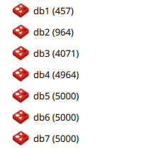
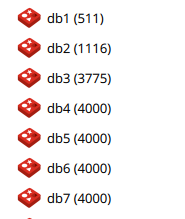
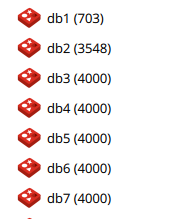
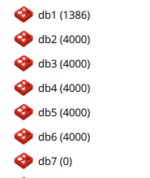
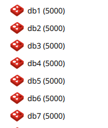

程序中Redis连接的时候,偶尔会出现下面问题:
```shell
redis.clients.jedis.exceptions.JedisConnectionException: Could not get a resource from the pool
	at redis.clients.util.Pool.getResource(Pool.java:42)
	at redis.clients.jedis.JedisPool.getResource(JedisPool.java:84)
	at redis.clients.jedis.JedisPool$getResource.call(Unknown Source)
```

下面进行测试:
```groovy
JedisPool pool(int maxTotal, long wait, int db) {
JedisPoolConfig poolConfig = new JedisPoolConfig()
poolConfig.setMaxTotal(maxTotal)
//        poolConfig.setMaxIdle(20)
poolConfig.setMaxWaitMillis(wait)
//        poolConfig.setTestOnBorrow(true)
//        poolConfig.setMinIdle(50)
if (StringUtils.isBlank(redisSetting.password)) {
    redisSetting.password = null
}
JedisPool pool = new JedisPool(
        poolConfig,
        redisSetting.host,
        redisSetting.port,
        redisSetting.timeout,
        redisSetting.password,
        db
)
clear(pool)
pool
}

static void clear(JedisPool pool) {
    Jedis jedis = pool.getResource()
    def count = jedis.eval("return #redis.call('flushdb')", 0)
    pool.returnResource(jedis)
    Thread.currentThread().sleep(1000)
}

void runThread(int threadCount, int db, int maxTotal, long wait) {
    JedisPool pool = pool(maxTotal, wait, db)
    (1..threadCount).each { i ->
        Thread.start {
            Jedis jedis = pool.getResource()
            jedis.set('000:' + i.toString(), i.toString())
            pool.returnResource(jedis)
        }
    }
}

void testThread() {
    int count = 5000
    long wait = 10
    runThread(count, 1, 1, wait)
    runThread(count, 2, 5, wait)
    runThread(count, 3, 10, wait)
    runThread(count, 4, 20, wait)
    runThread(count, 5, 50, wait)
    runThread(count, 6, 100, wait)
    runThread(count, 7, 200, wait)
}
```

针对`线程池大小`和从`JedisPool中借用的等待时间`来测试,每次使用5000或者4000个线程来操作不同的
数据库,操作之前清空掉该数据库:

### wait 10毫秒



### wait 50毫秒


### wait 100毫秒


### wait 1000毫秒


在只考虑稳定的情况下,上面测试可以看出,pool size设置为`50`及以上是一个比较安全的值,等待时间越长越安全.

---
END
