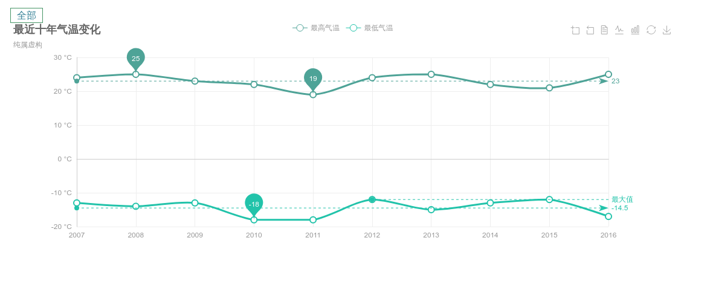
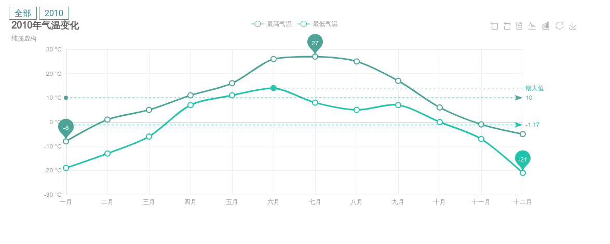
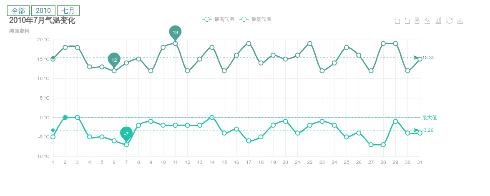

## 准备数据

```js
import _ from 'lodash'

function getChartOption (title, xAxisData, seriesMaxData, seriesMinData) {
  // const xAxisData = ['周一', '周二', '周三', '周四', '周五', '周六', '周日']
  // const seriesMaxData = [11, 11, 15, 13, 12, 13, 10]
  // const seriesMinData = [1, -2, 2, 5, 3, 2, 0]
  // const title = '一周气温变化'
  return {
    title: {
      text: title,
      subtext: '纯属虚构'
    },
    tooltip: {
      trigger: 'axis'
    },
    legend: {
      data: ['最高气温', '最低气温']
    },
    toolbox: {
      show: true,
      feature: {
        dataZoom: {
          yAxisIndex: 'none'
        },
        dataView: { readOnly: false },
        magicType: { type: ['line', 'bar'] },
        restore: {},
        saveAsImage: {}
      }
    },
    xAxis: {
      type: 'category',
      boundaryGap: false,
      data: xAxisData
    },
    yAxis: {
      type: 'value',
      axisLabel: {
        formatter: '{value} °C'
      }
    },
    series: [
      {
        name: '最高气温',
        type: 'line',
        data: seriesMaxData,
        markPoint: {
          data: [
            { type: 'max', name: '最大值' },
            { type: 'min', name: '最小值' }
          ]
        },
        markLine: {
          data: [
            { type: 'average', name: '平均值' }
          ]
        }
      },
      {
        name: '最低气温',
        type: 'line',
        data: seriesMinData,
        markPoint: {
          data: [
            { type: 'min', name: '最小值' }
          ]
        },
        markLine: {
          data: [
            { type: 'average', name: '平均值' },
            [{
              symbol: 'none',
              x: '90%',
              yAxis: 'max'
            }, {
              symbol: 'circle',
              label: {
                normal: {
                  position: 'start',
                  formatter: '最大值'
                }
              },
              type: 'max',
              name: '最高点'
            }]
          ]
        }
      }
    ]
  }
}

const random = (value, rdm) => value + parseInt(Math.random() * rdm - rdm * 2)

function getYearsOption (count) {
  // const count = 10
  const currentYear = new Date().getFullYear()
  const array = _.range(currentYear - count, currentYear)

  const title = '最近十年气温变化'
  const xAxisData = array
  const seriesMaxData = array.map((i) => random(34, 8))
  const seriesMinData = array.map((i) => random(-3, 8))
  const option = getChartOption(title, xAxisData, seriesMaxData, seriesMinData)
  option.children = {}
  xAxisData.forEach((year) => (option.children['' + year] = getYearOption(year)))
  return option
}

function getYearOption (year) {
  const title = `${year}年气温变化`
  const xAxisData = ['一月', '二月', '三月', '四月', '五月', '六月', '七月', '八月', '九月', '十月', '十一月', '十二月']
  const maxBase = [7, 11, 15, 25, 30, 35, 40, 40, 30, 20, 10, 5]
  const minBase = [-10, 1, 5, 15, 20, 25, 20, 20, 20, 10, 1, -8]
  const seriesMaxData = maxBase.map((i) => random(i, 8))
  const seriesMinData = minBase.map((i) => random(i, 8))
  const option = getChartOption(title, xAxisData, seriesMaxData, seriesMinData)
  option.children = {}
  // children 的key 是 xAxisData 的值
  xAxisData.forEach((month) => {
    const index = xAxisData.indexOf(month)
    const max = seriesMaxData[index]
    const min = seriesMinData[index]
    option.children[month] = getMonthOption(year, index + 1, max, min)
  })
  return option
}

/**
 *
 * @param year
 * @param month 阿拉伯数字 1-12
 * @param max
 * @param min
 * @returns {{title, tooltip, legend, toolbox, xAxis, yAxis, series}}
 */
function getMonthOption (year, month, max, min) {
  const title = `${year}年${month}月气温变化`
  const days = new Date(year, month, 0).getDate()

  const xAxisData = _.range(1, days + 1)
  const seriesMaxData = xAxisData.map((i) => random(max, 8))
  const seriesMinData = xAxisData.map((i) => random(min, 8))
  return getChartOption(title, xAxisData, seriesMaxData, seriesMinData)
}

export const tenYearOption = getYearsOption(10)

export function getOption (year, month) {
  if (year === undefined) {
    return tenYearOption
  } else if (month === undefined) {
    return tenYearOption.children[year]
  } else {
    return tenYearOption.children[year].children[month]
  }
}
```

```html
<template>
<div>
  <div>
    <a href="#" @click="rootClick">全部</a>
    <a href="#" v-show="currentYear" @click="yearClick">{{ currentYear }}</a>
    <a href="#" v-show="currentMonth" @click="monthClick">{{ currentMonth }}</a>
  </div>
  <chart class="chart" :options="option" ref="chart" theme="ovilia-green" @click="click" auto-resize></chart>
</div>
</template>

## Vue单文件模块

<script>
import { tenYearOption, getOption } from './data/temperature'

import ECharts from 'vue-echarts/components/ECharts'
import 'echarts/lib/chart/line'

export default {
  data () {
    return {
      option: tenYearOption,
      currentYear: '',
      currentMonth: ''
    }
  },
  methods: {
    click (object) {
      console.log(object)
      if (object.componentType = "series" && object.componentSubType === "line") {
        if (!this.currentYear) { // root view
          this.currentYear = object.name
          this.yearClick()
        } else if (!this.currentMonth) { // year view
          this.currentMonth = object.name
          this.monthClick()
        } else { // month view

        }
      }
    },
    rootClick () {
      this.$refs.chart.chart.setOption(tenYearOption)
        this.currentMonth = undefined
        this.currentYear = undefined
    },
    yearClick () {
      const option = getOption(this.currentYear)
      if (option) {
        this.$refs.chart.chart.setOption(option)
        this.currentMonth = undefined
      }
    },
    monthClick () {
      const option = getOption(this.currentYear, this.currentMonth)
      if (option) {
        this.$refs.chart.chart.setOption(option)
      }
    }
  },
  mounted () {
  }
}
</script>

<style lang="stylus" scoped>
a
  text-decoration: none;
  color: #368297;
  border: #469566 solid 1px;
  padding: 2px 10px;

.chart
  width 100%
</style>
```

## 截图








---
END
