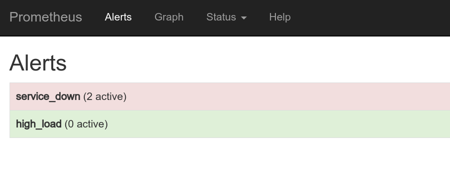

## docker-compose.yml
```yaml

services:
  prometheus:
    image: prom/prometheus:v1.5.2
    container_name: prometheus
    volumes:
      - ./prometheus/:/etc/prometheus/
      - prometheus_data:/prometheus
    command:
      - '-config.file=/etc/prometheus/prometheus.yml'
      - '-storage.local.path=/prometheus'
      - '-alertmanager.url=http://alertmanager:9093'
    expose:
      - 9090
    ports:
      - 30020:9090
    links:
      - alertmanager:alertmanager
    networks:
      - back-tier
  
  alertmanager:
    container_name: alert-manager
    image: prom/alertmanager:v0.5.1
    ports:
      - 9093:9093
    volumes: 
      - ./alertmanager/:/etc/alertmanager/
    networks:
      - back-tier
    command:
      - '-config.file=/etc/alertmanager/config.yml'
      - '-storage.path=/alertmanager'
    environment:
      - SMTP_AUTH_USERNAME=xxx@xxx.com
      - SMTP_AUTH_PASSWORD=xxxxx
```

## prometheus config
```yaml
# my global config
global:
  scrape_interval:     15s # By default, scrape targets every 15 seconds.
  evaluation_interval: 15s # By default, scrape targets every 15 seconds.
  # scrape_timeout is set to the global default (10s).

  # Attach these labels to any time series or alerts when communicating with
  # external systems (federation, remote storage, Alertmanager).
  external_labels:
      monitor: 'my-project'

# Load and evaluate rules in this file every 'evaluation_interval' seconds.
rule_files:
  - "alert.rules"
  # - "first.rules"
  # - "second.rules"

# A scrape configuration containing exactly one endpoint to scrape:
# Here it's Prometheus itself.
scrape_configs:
  - job_name: 'springboot0'
    scrape_interval: 3s
    scrape_timeout: 1s

    metrics_path: '/prometheus'
    static_configs:
      - targets: ['192.168.95.49:7777']
        labels:
          group: 'proj'
          node: 'xxx'
          proj: 'xxx'
```


## alert.rules
```
ALERT service_down
  IF up == 0

ALERT high_load
  IF node_load1 > 0.5
  ANNOTATIONS {
      summary = "Instance {{ $labels.instance }} under high load",
      description = "{{ $labels.instance }} of job {{ $labels.job }} is under high load.",
  }
```

## alertmanager config
```yaml
global:
  # The smarthost and SMTP sender used for mail notifications.
  smtp_smarthost: 'smtp.xxx.com:994'
  smtp_from: 'xxx@xxx.com'

#  smtp_auth_username: awang@ittx.com
#  smtp_auth_password: Chengyi.1

route:
  group_by: [Alertname]
  # Send all notifications to me.
  receiver: email-me

  group_wait: 3s

  # When the first notification was sent, wait 'group_interval' to send a batch
  # of new alerts that started firing for that group.
  group_interval: 5s

  # If an alert has successfully been sent, wait 'repeat_interval' to
  # resend them.
  repeat_interval: 10s

  # A default receiver
  receiver: email-me

receivers:
- name: email-me
  email_configs:
  - to: xxx@xxx.com.cn
    from: xxx@xxx.com
```

## prometheus



## alert manager
````
alert-manager   | time="2017-06-27T05:15:41Z" level=error msg="Error on notify: EOF" source="notify.go:272" 
alert-manager   | time="2017-06-27T05:15:41Z" level=error msg="Notify for 2 alerts failed: EOF" source="dispatch.go:246" 
alert-manager   | time="2017-06-27T05:16:01Z" level=error msg="Error on notify: EOF" source="notify.go:272" 
alert-manager   | time="2017-06-27T05:16:01Z" level=error msg="Notify for 2 alerts failed: EOF" source="dispatch.go:246" 
alert-manager   | time="2017-06-27T05:16:21Z" level=error msg="Error on notify: EOF" source="notify.go:272" 
alert-manager   | time="2017-06-27T05:16:21Z" level=error msg="Notify for 2 alerts failed: EOF" source="dispatch.go:246" 
alert-manager   | time="2017-06-27T05:16:42Z" level=error msg="Error on notify: EOF" source="notify.go:272" 
alert-manager   | time="2017-06-27T05:16:42Z" level=error msg="Notify for 2 alerts failed: EOF" source="dispatch.go:246" 
alert-manager   | time="2017-06-27T05:17:02Z" level=error msg="Error on notify: EOF" source="notify.go:272" 
alert-manager   | time="2017-06-27T05:17:02Z" level=error msg="Notify for 2 alerts failed: EOF" source="dispatch.go:246" 
alert-manager   | time="2017-06-27T05:17:22Z" level=error msg="Error on notify: EOF" source="notify.go:272" 
alert-manager   | time="2017-06-27T05:17:22Z" level=error msg="Notify for 2 alerts failed: EOF" source="dispatch.go:246" 
alert-manager   | time="2017-06-27T05:17:42Z" level=error msg="Error on notify: EOF" source="notify.go:272" 
alert-manager   | time="2017-06-27T05:17:42Z" level=error msg="Notify for 2 alerts failed: EOF" source="dispatch.go:246" 
alert-manager   | time="2017-06-27T05:18:03Z" level=error msg="Error on notify: EOF" source="notify.go:272" 
alert-manager   | time="2017-06-27T05:18:03Z" level=error msg="Notify for 2 alerts failed: EOF" source="dispatch.go:246" 
alert-manager   | time="2017-06-27T05:18:23Z" level=error msg="Error on notify: EOF" source="notify.go:272" 
alert-manager   | time="2017-06-27T05:18:23Z" level=error msg="Notify for 2 alerts failed: EOF" source="dispatch.go:246" 
alert-manager   | time="2017-06-27T05:18:43Z" level=error msg="Error on notify: EOF" source="notify.go:272" 
alert-manager   | time="2017-06-27T05:18:43Z" level=error msg="Notify for 2 alerts failed: EOF" source="dispatch.go:246" 
````

## 相关链接
https://github.com/prometheus/alertmanager/issues/766
https://github.com/prometheus/alertmanager/issues/705
https://github.com/prometheus/alertmanager/issues/275
https://github.com/prometheus/alertmanager/pull/266
https://github.com/prometheus/alertmanager/issues/327
https://github.com/prometheus/alertmanager/pull/308
https://prometheus.io/docs/alerting/configuration/#email-receiver-
https://www.robustperception.io/sending-email-with-the-alertmanager-via-gmail/


## exmail和163mail的smtp配置
### exmail
```
POP3/SMTP协议
接收邮件服务器：pop.exmail.qq.com ，使用SSL，端口号995
发送邮件服务器：smtp.exmail.qq.com ，使用SSL，端口号465
海外用户可使用以下服务器
接收邮件服务器：hwpop.exmail.qq.com ，使用SSL，端口号995
发送邮件服务器：hwsmtp.exmail.qq.com ，使用SSL，端口号465
 
IMAP协议
接收邮件服务器：imap.exmail.qq.com  ，使用SSL，端口号993
发送邮件服务器：smtp.exmail.qq.com ，使用SSL，端口号465
海外用户可使用以下服务器
接收邮件服务器：hwimap.exmail.qq.com ，使用SSL，端口号993
发送邮件服务器：hwsmtp.exmail.qq.com ，使用SSL，端口号465
```

---
END
