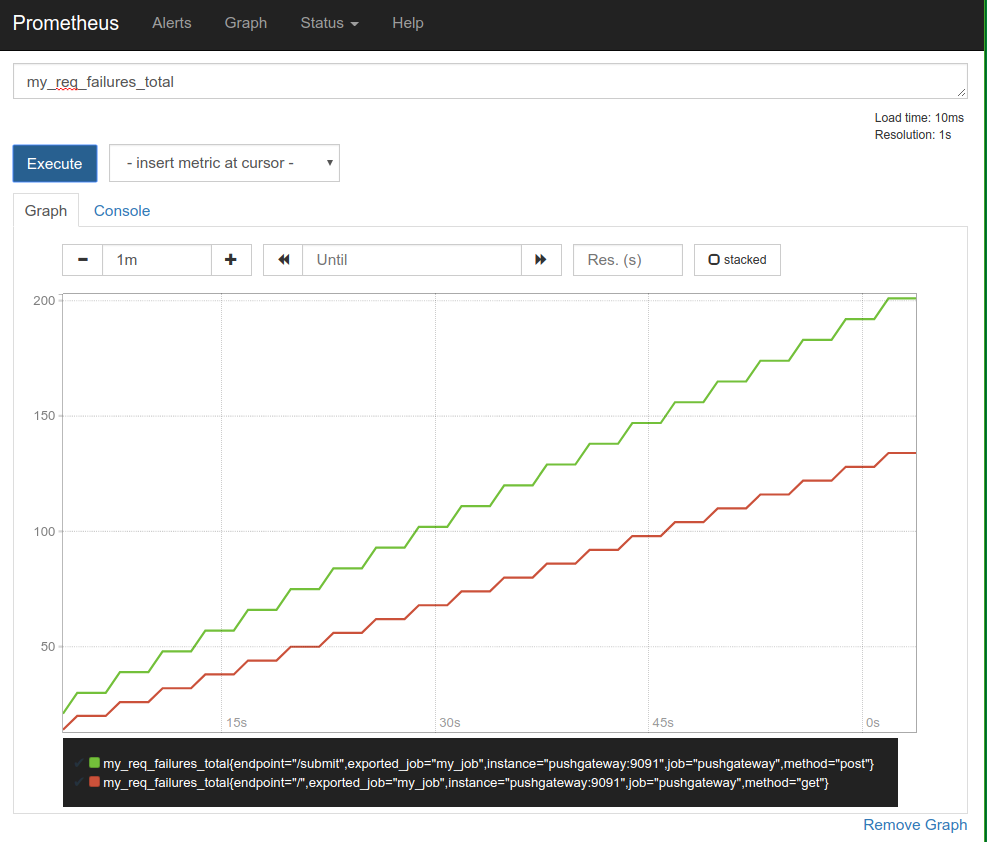

## Counter
- Counter 用于累计值，例如 记录 请求次数、任务完成数、错误发生次数。
- 一直增加，不会减少。
- 重启进程后，会被重置

```shell
http_response_total{method="GET",endpoint="/api/tracks"} 100
http_response_total{method="GET",endpoint="/api/tracks"} 100
```

## Gauge
- Gauge 常规数值，例如 温度变化、内存使用变化。
- 可变大，可变小。
- 重启进程后，会被重置

```shell
memory_usage_bytes{host="master-01"} 100
memory_usage_bytes{host="master-01"} 30
memory_usage_bytes{host="master-01"} 50
memory_usage_bytes{host="master-01"} 80
```

## Histogram

- Histogram 可以理解为柱状图的意思，常用于跟踪事件发生的规模，
例如：请求耗时、响应大小。它特别之处是可以对记录的内容进行分组，
提供 count 和 sum 全部值的功能。

```shell
{小于10=5次，小于20=1次，小于30=2次}，count=7次，sum=7次的求和值
```

## Summary

- Summary和Histogram十分相似，常用于跟踪事件发生的规模，例如：请求耗时、响应大小。同样提供 count 和 sum 全部值的功能。
- 例如：count=7次，sum=7次的值求值
- 它提供一个quantiles的功能，可以按%比划分跟踪的结果。例如：quantile取值0.95，表示取采样值里面的95%数据

```
To pick between counter and gauge, there is a simple rule of thumb: 
if the value can go down, it is a gauge.

Counters can only go up (and reset, such as when a process restarts). 
They are useful for accumulating the number of events, 
or the amount of something at each event. For example, 
the total number of HTTP requests, 
or the total number of bytes sent in HTTP requests. 
Raw counters are rarely useful. Use the rate() function 
to get the per-second rate at which they are increasing.

Gauges can be set, go up, and go down. 
They are useful for snapshots of state, 
such as in-progress requests, 
free/total memory, or temperature. 
You should never take a rate() of a gauge.
```

## Python Client demo
```python
import time

import schedule
from prometheus_client import CollectorRegistry, push_to_gateway
from prometheus_client import Counter
from prometheus_client import Gauge
from prometheus_client import Histogram
from prometheus_client import Summary

registry = CollectorRegistry()
c = Counter('my_req_failures_total', 'Description of counter', ['method', 'endpoint'], registry=registry)
g = Gauge('my_inprogress_requests', 'Description of gauge', registry=registry)
h = Histogram('my_request_latency_seconds_h', 'Description of histogram', registry=registry)
s = Summary('my_request_latency_seconds_s', 'Description of summary', registry=registry)


def test_counter():
    c.labels('get', '/').inc(2)
    c.labels('post', '/submit').inc(3)
    # c.labels(method='get', endpoint='/').inc()
    # c.labels(method='post', endpoint='/submit').inc()


def test_counter_without_labels():
    c = Counter('my_req_failures_total', 'Description of counter', registry=registry)
    c.inc()  # Increment by 1
    c.inc(1.6)  # Increment by given value


def test_gauge():
    g.inc()  # Increment by 1
    g.dec(10)  # Decrement by given value
    g.set(4.2)  # Set to a given value


def test_summary():
    s.observe(4.7)  # Observe 4.7 (seconds in this case)


def test_histogram():
    h.observe(4.7)  # Observe 4.7 (seconds in this case)


def update():
    test_counter()
    test_gauge()
    test_histogram()
    test_summary()


def push_guage():
    update()
    push_to_gateway('localhost:9091', job='my_job', registry=registry)
    print(time.time())


if __name__ == '__main__':
    schedule.every(1).seconds.do(push_guage)
    while True:
        schedule.run_pending()
        time.sleep(1)
```



---

Links:
- [docs](https://prometheus.io/docs/concepts/metric_types/)
- [比较]('https://prometheus.io/docs/practices/instrumentation/#counter-vs.-gauge,-summary-vs.-histogram')
- [cnblogs](http://www.cnblogs.com/vovlie/p/Prometheus_CONCEPTS.html)

---
END
