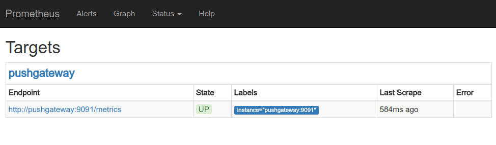
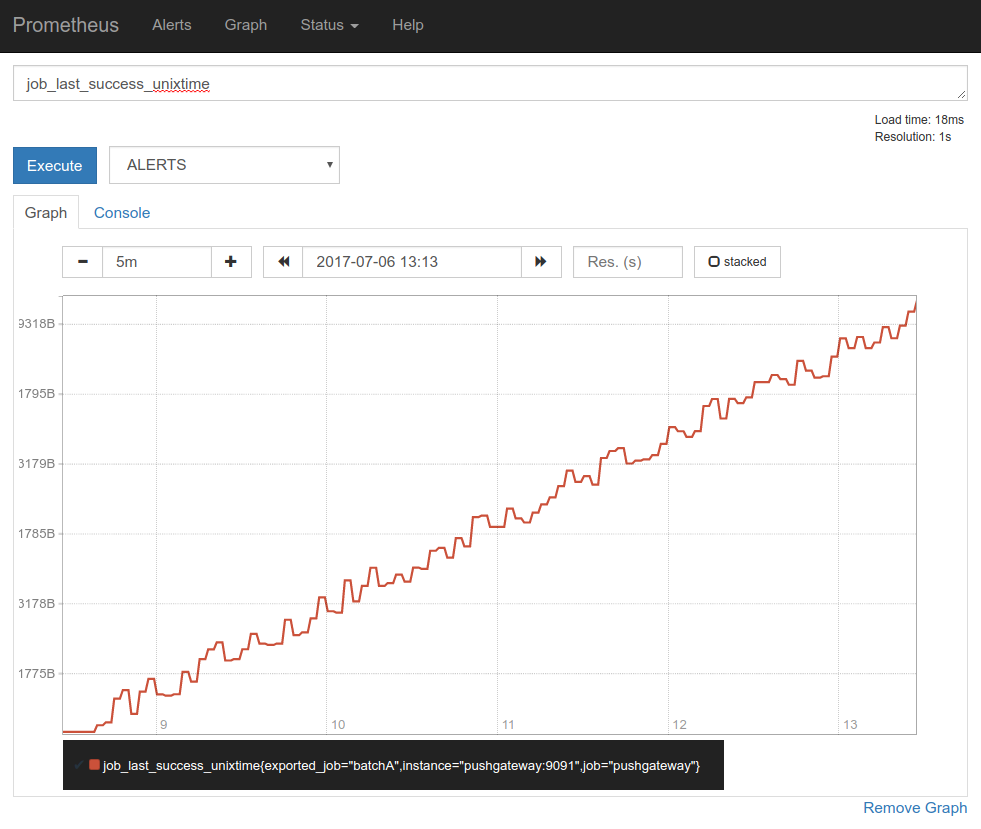

Prometheus默认是采用`pull`的方式来获取监控数据,对于`push`方式来提交数据,Prometheus提供了`pushgateway`工具.

## 配置 Docker Compose 启动 PushGateway
```yml
version: '2'

networks:
  back-tier:
    driver: bridge
    
services:
  prometheus:
    image: prom/prometheus:v1.5.2
    container_name: prometheus
    volumes:
      - ./prometheus/:/etc/prometheus/
      - ./prometheus_data:/prometheus
    command:
      - '-config.file=/etc/prometheus/prometheus.yml'
      - '-storage.local.path=/prometheus'
      - '-alertmanager.url=http://alertmanager:9093'
    expose:
      - 9090
    ports:
      - 30020:9090
    links:
      - pushgateway:pushgateway
    networks:
      - back-tier

  pushgateway:
    image: prom/pushgateway:v0.4.0
    ports:
      - 9091:9091
    command:
      - 'persistence.file=/storage/persistence.db'
    volumes:
      - ./tmp/pushgateway/persistence.db:/storage/persistence.db
    networks:
      - back-tier
```

## 修改Prometheus配置
```yml
scrape_configs:
  - job_name: 'pushgateway'
    scrape_interval: 3s
    scrape_timeout: 1s

    metrics_path: '/metrics'
    static_configs:
      - targets: ['pushgateway:9091']
```

如果Prometheus已经启动,可以重新加载配置:
```shell
$ curl -s -XPOST localhost:30020/-/reload
```

## 启动并检查状态
```shell
$ docker-compose up
```
访问Prometheus `http://localhost:30020/targets`: 


## 推送数据到PushGateway

```shell
echo "some_metric 3.14" | curl --data-binary @- http://pushgateway.:9091/metrics/job/some_job
echo "some_metric 6.14" | curl --data-binary @- http://pushgateway.:9091/metrics/job/some_job
echo "some_metric 6.14" | curl --data-binary @- http://pushgateway.:9091/metrics/job/some_job
echo "some_metric 2.14" | curl --data-binary @- http://pushgateway.:9091/metrics/job/some_job
echo "some_metric 6.14" | curl --data-binary @- http://pushgateway.:9091/metrics/job/some_job
echo "some_metric 2.14" | curl --data-binary @- http://pushgateway.:9091/metrics/job/some_job
```
## 查询结果


## 使用 python prometheus client 模块
安装:
```shell
$ pip install prometheus_client
```
```python
import random
import time

import schedule
from prometheus_client import CollectorRegistry, Gauge, push_to_gateway


def push_guage():
    registry = CollectorRegistry()
    g = Gauge('job_last_success_unixtime', 'Last time a batch job successfully finished', registry=registry)
    g.set_to_current_time()
    g.inc(random.randint(-10, 10))

    g2 = Gauge('a_test_random', 'Just a random value', registry=registry)
    g2.set(99)
    g2.inc(random.randint(-10, 10))

    push_to_gateway('localhost:9091', job='batchA', registry=registry)
    print(time.time())


if __name__ == '__main__':
    schedule.every(1).seconds.do(push_guage)
    while True:
        schedule.run_pending()
        time.sleep(1)
```



---

一些资源:
- [Github](https://github.com/prometheus/pushgateway)
- [WHEN TO USE THE PUSHGATEWAY](https://prometheus.io/docs/practices/pushing/)
- [Docker Hub](https://hub.docker.com/r/prom/pushgateway/)
- [prometheus python python](https://github.com/prometheus/client_python)
- [Python Schedule](https://github.com/dbader/schedule)

---
END
