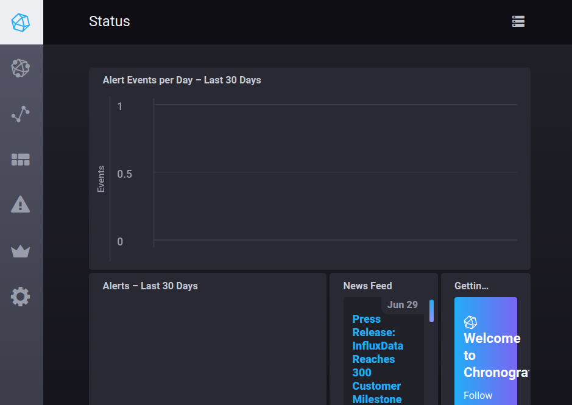

使用｀compose`运行TICK, 运行成功后打开chronograf的[界面](http://localhost:8888/)



## 创建数据库
```
curl -XPOST 'http://localhost:8086/query' --data-urlencode "q=CREATE DATABASE mydb"
```
## 插入数据
```
curl -XPOST 'http://localhost:8086/write?db=mydb' \
-d 'cpu,host=server01,region=uswest load=42 1434055562000000000'

curl -XPOST 'http://localhost:8086/write?db=mydb' \
-d 'cpu,host=server02,region=uswest load=78 1434055562000000000'

curl -XPOST 'http://localhost:8086/write?db=mydb' \
-d 'cpu,host=server03,region=useast load=15.4 1434055562000000000'
```

## 查询数据
```
curl -G http://localhost:8086/query?pretty=true --data-urlencode "db=mydb" \
--data-urlencode "q=SELECT * FROM cpu WHERE host='server01' AND time < now() - 1d"
```

## Analyze the data
```
curl -G http://localhost:8086/query?pretty=true --data-urlencode "db=mydb" \
--data-urlencode "q=SELECT mean(load) FROM cpu WHERE region='uswest'"
```

## python client
```shell
$ pip install influxdb
$ pip install --upgrade influxdb
$ pip uninstall influxdb
```
```python
json_body = [
    {
        "measurement": "cpu_load_short",
        "tags": {
            "host": "server01",
            "region": "us-west"
        },
        "time": "2009-11-10T23:00:00Z",
        "fields": {
            "value": random.randint(10, 30)
        }
    }
]

client = InfluxDBClient('localhost', 8086, 'root', 'root', 'example')
client.create_database('example')
client.write_points(json_body)
result = client.query('select value from cpu_load_short;')
print("Result: {0}".format(result))
```

---
Links:
- https://github.com/influxdata/influxdb
- https://github.com/influxdata/TICK-docker/blob/master/README.md
- https://docs.influxdata.com/influxdb/v1.2/introduction/getting_started/
- https://github.com/influxdata/influxdb-python


---
END
