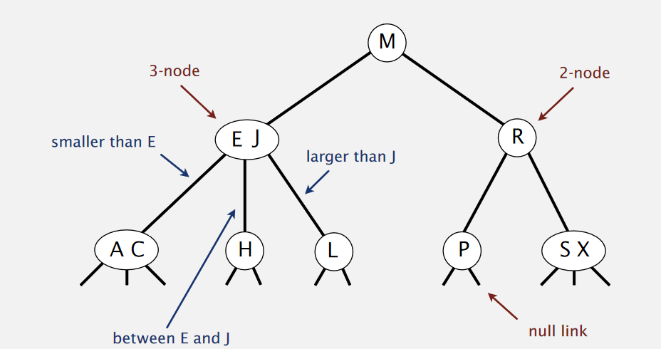

## 定义
2-3 树是一种特殊的二叉树,允许每个节点上有1个或两个key,2个或3个子节点:
- 2节点：1个key，2个孩子
- 3节点，2个key，3个孩子

## 查找
查找类似二叉树.

## 插入
如果插入的节点是一个2-节点：直接把2节点变成3节点

如果插入的是一个3-节点：
- 把key加入3-节点变成一个临时4-节点
- 把4节点的中间key上移到父亲节点
- 重复操作。
- 如果到达了root，形成了一个临时4节点，则root节点分裂成3个节点，树高增加1层

动画如下

---
Links:
- http://www.2cto.com/kf/201605/512253.html

---
END
