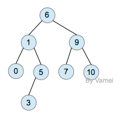
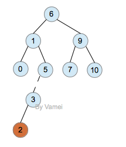
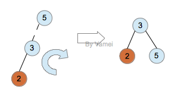
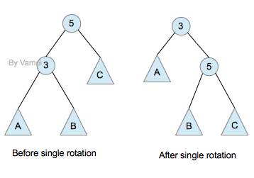
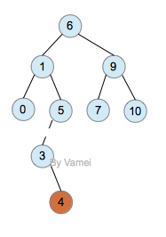
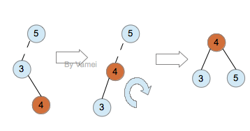
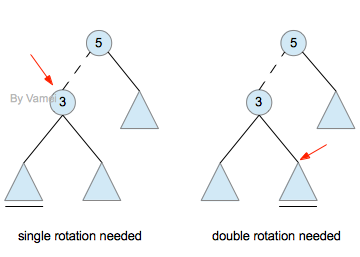

### 定义
任一节点的左子树深度和右子树深度相差不超过1.

AVL树的特性让二叉搜索树的节点实现平衡(balance)：
节点相对均匀分布，而不是偏向某一侧。因此，AVL树的搜索算法复杂度是log(n)的量级。

### 插入

如果进行插入操作，有可能会破坏AVL树的性质，比如:

可以通过旋转来实现平衡

结果

如下数据

通过双旋转来实现平衡

双旋转结果

---
Links:
- http://www.cnblogs.com/vamei/archive/2013/03/21/2964092.html

---
END
