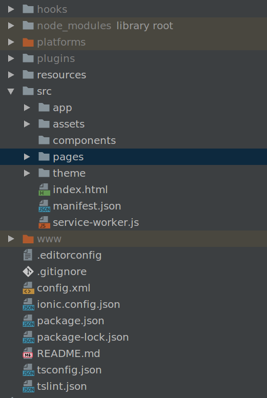
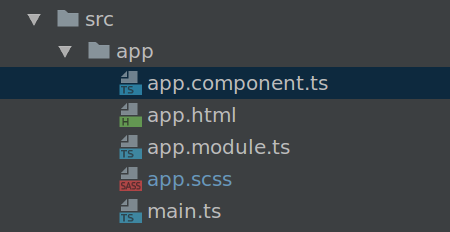
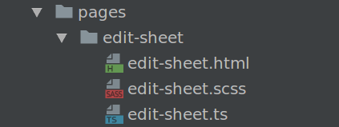

昨天用Ionic3和Angular4做了一个TeamForce客户端,简单记录下.

安装:
```shell
$ npm install -g ionic cordova
```

生成项目:
```shell
$ ionic start teamforce sidemenu
```

模板有:
- `tabs`: a simple 3 tab layout
- `sidemenu`: a layout with a swipable menu on the side
- `blank`: a bare starter with a single page
- `super`: starter project with over 14 ready to use page designs
- `tutorial`: a guided starter project

目录结构如下:



浏览器运行:
```shell
$ cd teamforec
$ ionic serve
```

`src/app` 下的文件:



- `app.module.ts`: `@NgModule`的定义
- `app.component.ts`: 主要定义菜单
 - `rootPage: any = LoginPage` 定义主页

`src/pages` 用来定义页面:



每个页面一般包含 `ts`,`html`,`scss`三部分,可以使用`ionic-cli`生成:

```shell
$ ionic generate page login
```

会在`pages`下面创建文件夹,和相关文件.并且在`app.module.ts`中注册.

如果是手动新建的文件,我们需要在`app.module.ts`的`declarations`,`entryComponents`进行注册.
并且加到菜单(`app.component.ts`)里面.

> ```shell
> $ ionic generate [<type>] [<name>]
> ```
> type	The type of generator (e.g. `component`, `directive`, `page`, `pipe`, `provider`, `tabs`)


## 模板中常用的地方
- 绑定值 `[(ngModel)]="project"`
- 绑定节点 `#projectSelect`
- 绑定事件 `(ionChange)="selectProject(projectSelect.value)`
- 绑定属性 `[value]="project.code"`
- 值 `{{ value }}`

示例:
```html
<ion-select [(ngModel)]="project" #projectSelect (ionChange)="selectProject(projectSelect.value)"
            interface="action-sheet">
  <ion-option *ngFor="let project of projects" [value]="project.code">
    {{project.code + ' ' + project.name}}
  </ion-option>
</ion-select>
```

## 页面的编写
```ts
@Component({
  selector: 'page-edit-sheet',
  templateUrl: 'edit-sheet.html',
})
export class EditSheetPage {
  private projects: Project[]
  private project: string
  
  constructor(public navCtrl: NavController, public navParams: NavParams, private dataService: DataService) {
    this.date = navParams.get('date')
    dataService.getProjects().subscribe(projects => this.projects = projects)
  }
  
  selectBill() {
  }
}
```

通过`@Component`指定`selector`(css中用),和`templateUrl`,然后`export class`即可.

## http
Angular的http模块:
```ts
import { Injectable } from '@angular/core'
import { Headers, Http } from '@angular/http'
import 'rxjs/add/operator/map'
import { Observable } from "rxjs/Observable"

@Injectable()
export class DataService {

  constructor(public http: Http) {
  }
  
  getHeaders() {
    return new Headers({
      key: 'value'
    })
  }

  login(username: string, password: string): Observable<any> {
    const req = this.http
      .post(`${this.URL}/login`, {
        username: username,
        password: password
      })
    return req
  }

  getTimeSheets(date: string): Observable<Sheet[]> {
    const URL = `${this.URL}/date`
    return this.http.get(URL, {
      headers: this.getHeaders()
    }).map(response => {
      return (response.text().length > 0) ? response.json() : {}
    }).map(map => {
      return (map[date]) ? map[date] : []
    })
  }

  getProjects(): Observable<Project[]> {
    const URL = `${this.URL}/projects`
    return this.http.post(URL, {params1: "value1"}, {
      headers: this.getHeaders()
    }).map(resp =>
      resp.json()
    )
  }
}
```
Angular http 返回`Observable`对象,并且实现了泛型.

读取数据的时候,使用`subscribe`即可,**每次subscribe都会发送一次请求**.
```ts
dataService.getProjects().subscribe(projects => this.projects = projects)
```
新版本据说默认支持了json,不用对Observable进行map了.

`Service`可以通过`ionic cli`工具进行生成.同样要在`app.module.ts`里面注册.

### swipe
`ion-content`不支持`swipe`事件,在content里面增加一个div,高度设置为100%,对他使用`swipe`事件.

有一个类型的小问题:
```html
<div class="cards" (swipe)="swipeEvent($event)">
```
```ts
import { AlertController, Gesture, NavController, NavParams } from "ionic-angular"
import { DIRECTION_LEFT, DIRECTION_RIGHT } from "ionic-angular/gestures/hammer"

swipeEvent($event: Gesture) {
  switch (parseInt($event.direction)) {
    case DIRECTION_LEFT: // 2
      this.swipeLeftEvent($event)
      return
    case DIRECTION_RIGHT: // 4
      this.swipeRightEvent($event)
      return
  }
}
```

`Gesture.direction`是`string`类型, 但是实际数据是`number`类型.


## 小结
用下来,感觉
- Angular还是一个大而全的框架
- typescript对Ide更有好,同样带来了更高学习成和框架搭建集成的成本
- 两者结合对熟悉的人可能很方便,对不熟悉的人来说太复杂

---
Links:
- [Ionic官网](http://ionicframework.com/)
- [Ionic Install](http://ionicframework.com/docs/intro/installation/)
- [Ionic Tutorial](http://ionicframework.com/docs/intro/tutorial/)
- [Ionic Creator](https://creator.ionic.io/app/login)
- [Angular Components](http://ionicframework.com/docs/components/)
- [TypeScript泛型](https://www.tslang.cn/docs/handbook/generics.html)
- [Angula中文文档](https://www.angular.cn/docs/ts/latest/guide/)
- [Angular教程 http](https://angular.io/guide/http)
- [Angular教程Live](https://embed.plnkr.co/?show=preview)
- [segmentfault angular教程](https://segmentfault.com/a/1190000008754631)


---
END
