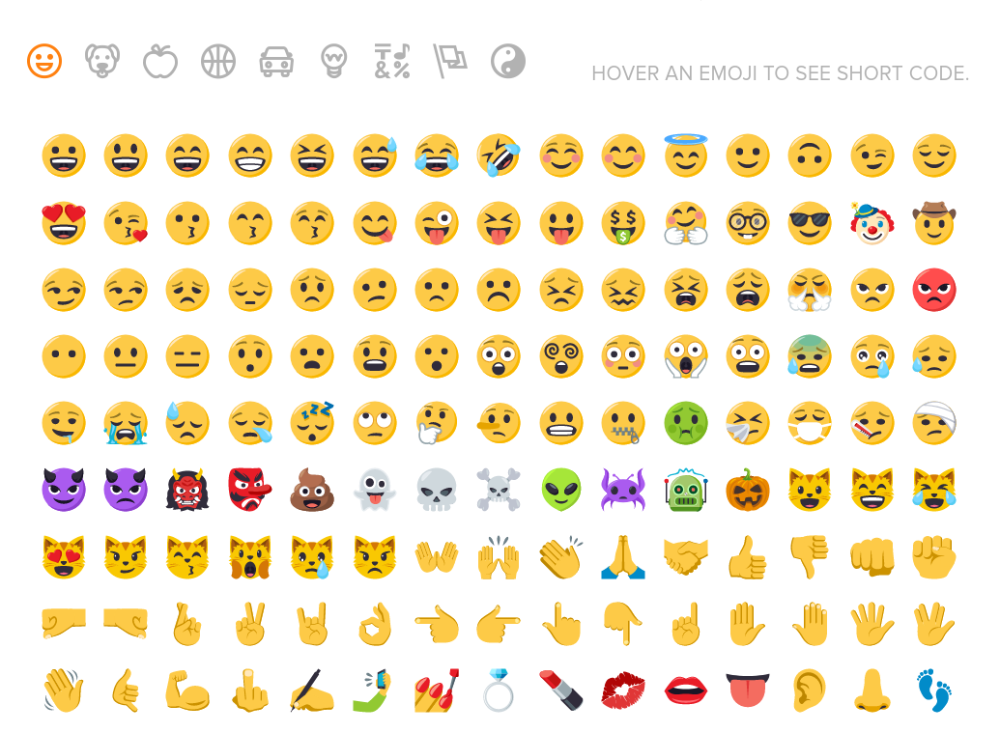
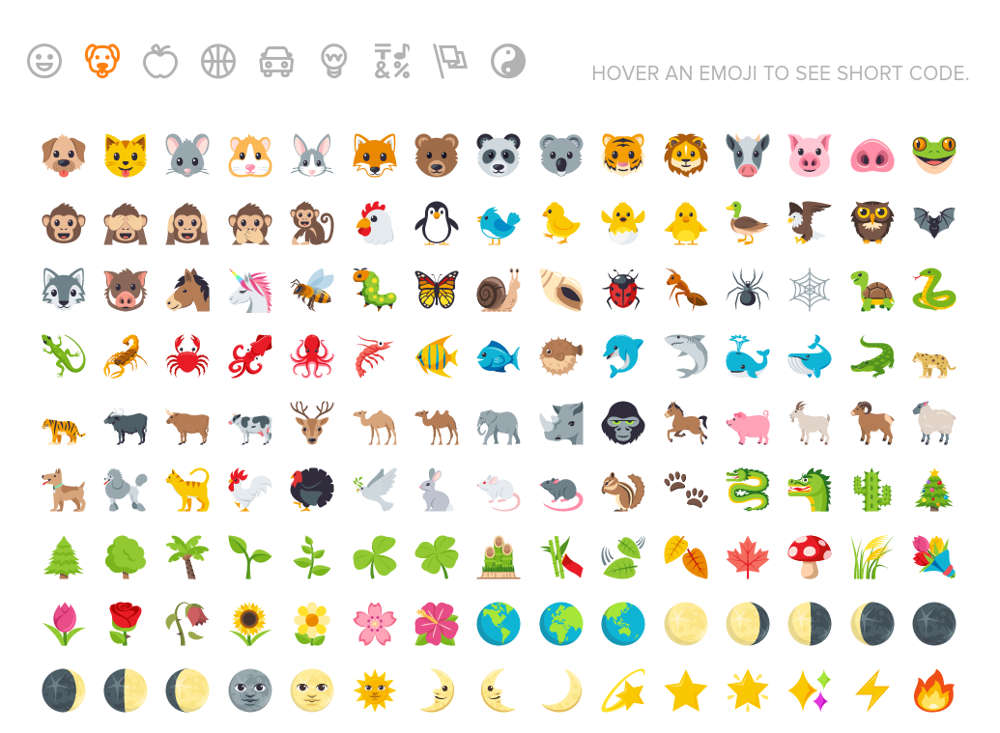
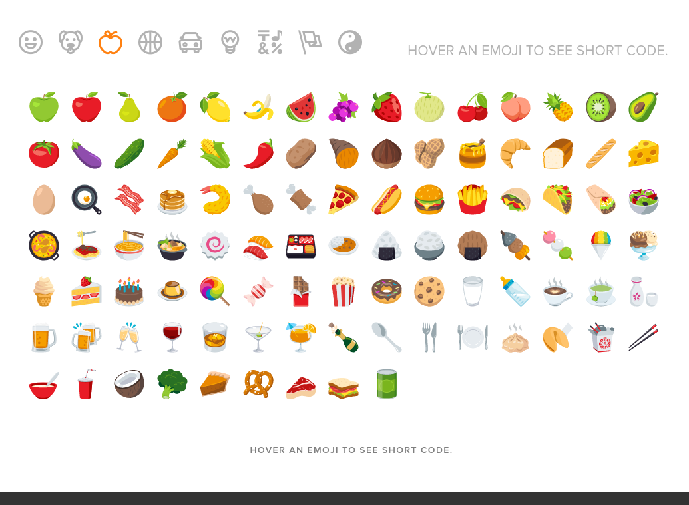
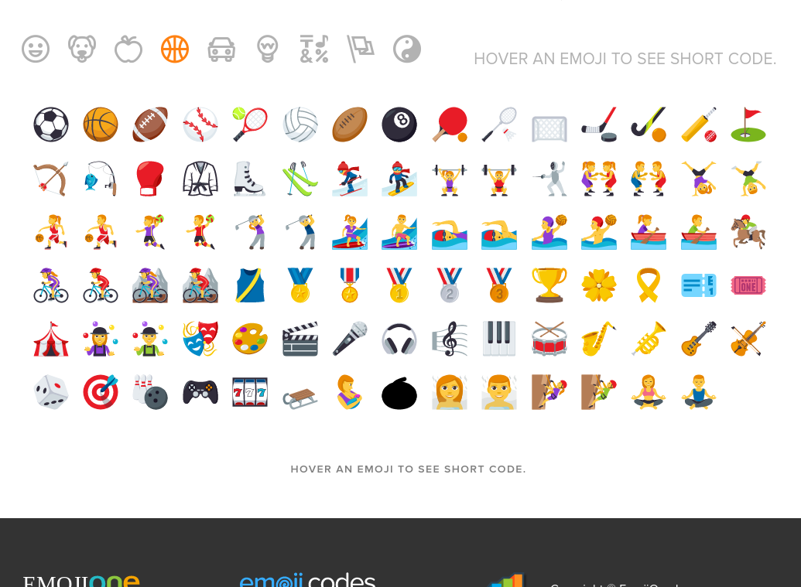
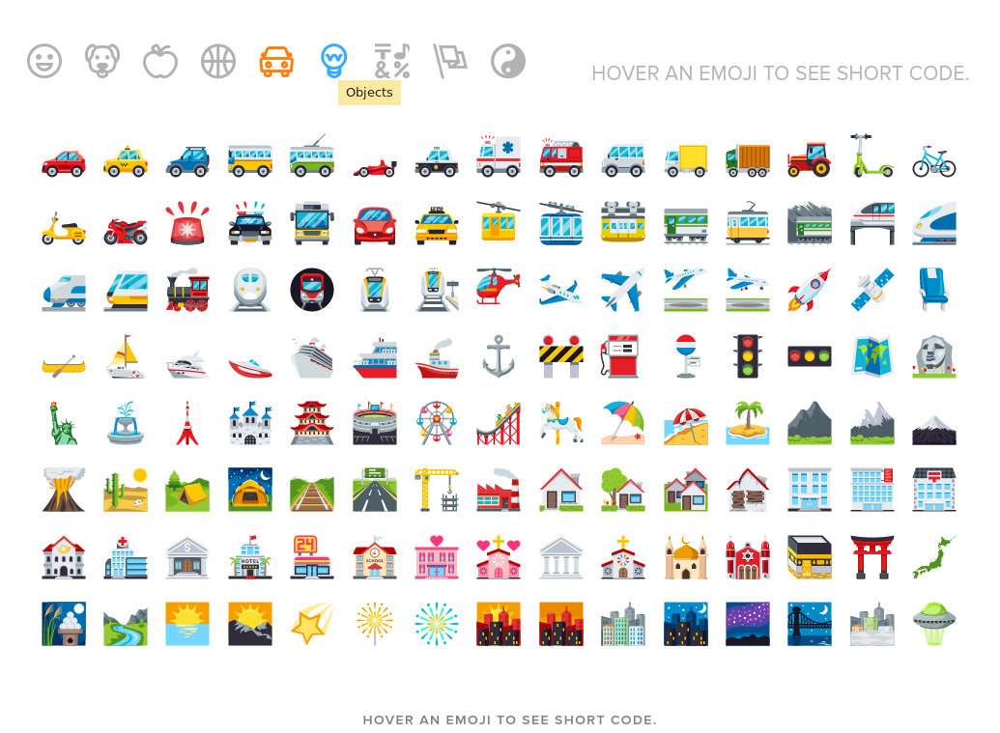
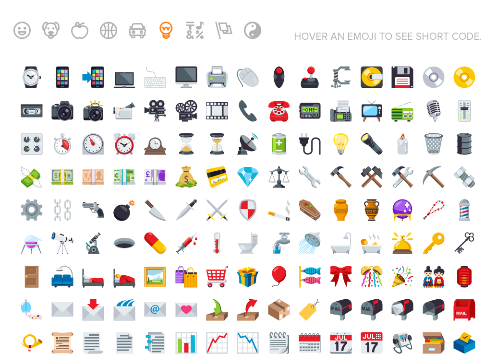
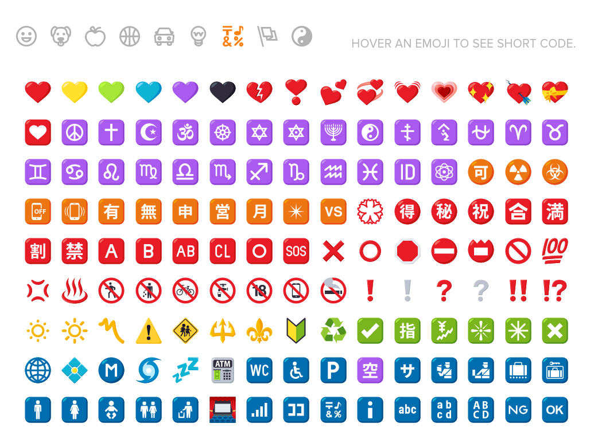
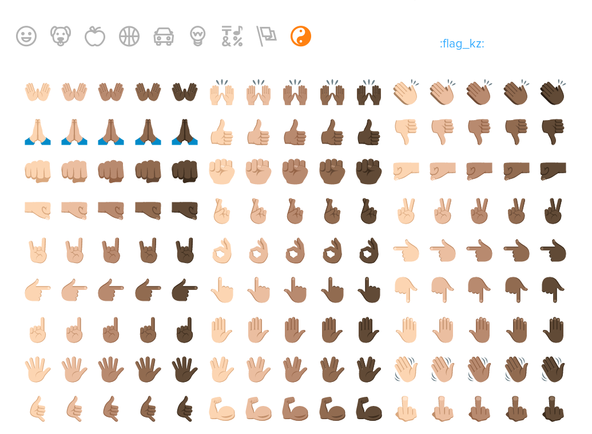

Gitlab wiki支持 emoji.

> Sometimes you want to :monkey: around a bit and add some :star2: to your :speech_balloon:. Well we have a gift for you:

```markdown
Sometimes you want to :monkey: around a bit and add some :star2: to your :speech_balloon:. Well we have a gift for you:
```

Emoji的列表可以在下面网站找到


















--- 
Links:
- https://emoji.codes/#
- http://gitlab.com/help/markdown/markdown#emoji

---
END
