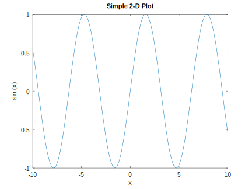

```shell
mkdir programs/octave && cd programs/octave
wget ftp://ftp.gnu.org/gnu/octave/octave-4.2.1.tar.xz
sudo apt-get build-dep octave
xz -d octave-4.2.1.tar.xz
tar xvf octave-4.2.1.tar
cd octave-4.2.1
./configure --prefix=/home/alan/programs/octave/octave
make
sudo make install
```

运行代码:
```python
x = -10:0.1:10; # Create an evenly-spaced vector from -10..10
y = sin (x);    # y is also a vector
plot (x, y);
title ("Simple 2-D Plot");
xlabel ("x");
ylabel ("sin (x)");
```



---
Links:
- https://www.gnu.org/software/octave/download.html
- https://www.gnu.org/software/octave/doc/interpreter/
- https://octave.sourceforge.io/
- https://octave.sourceforge.io/packages.php

---
END
