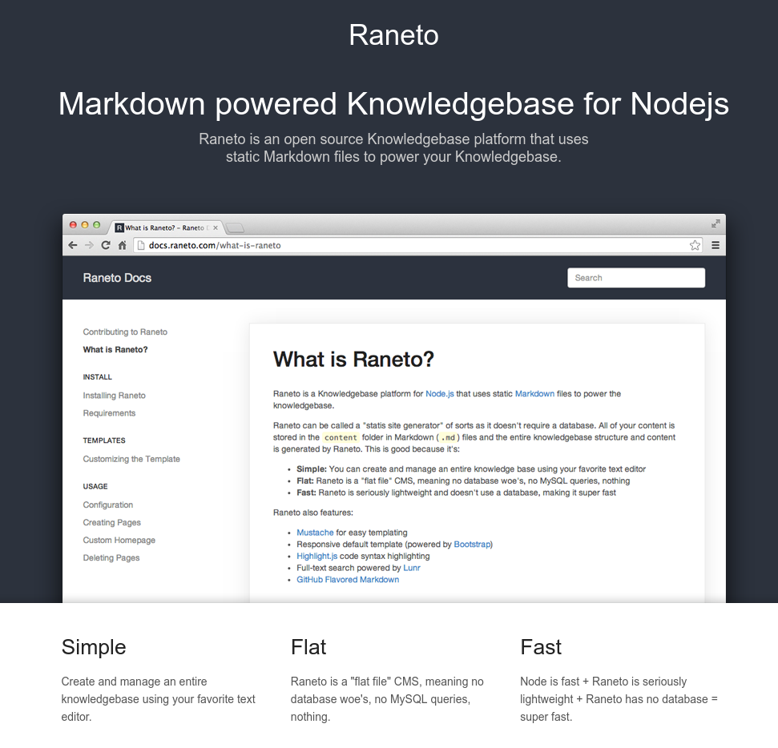
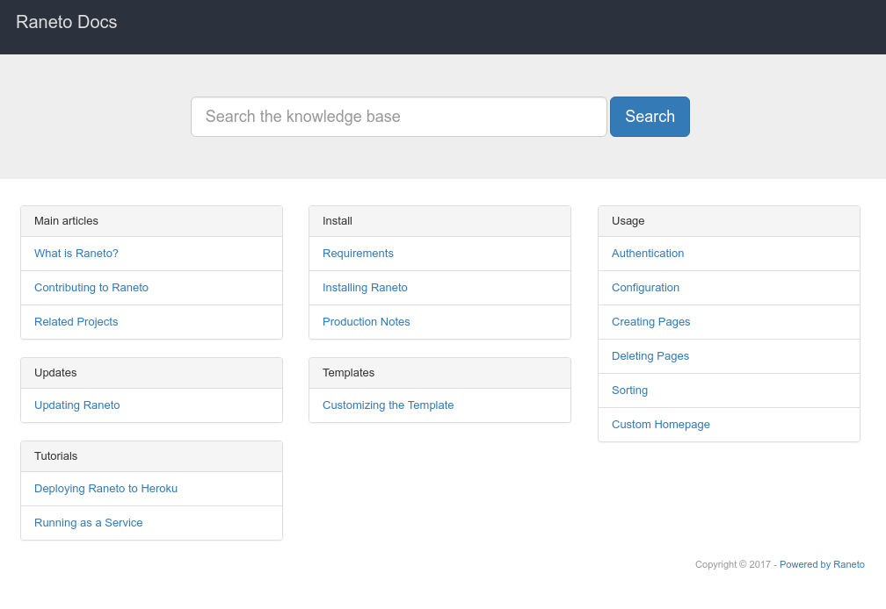
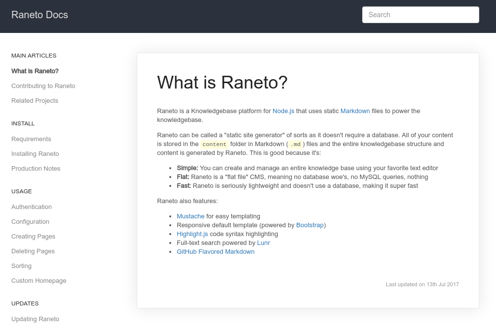
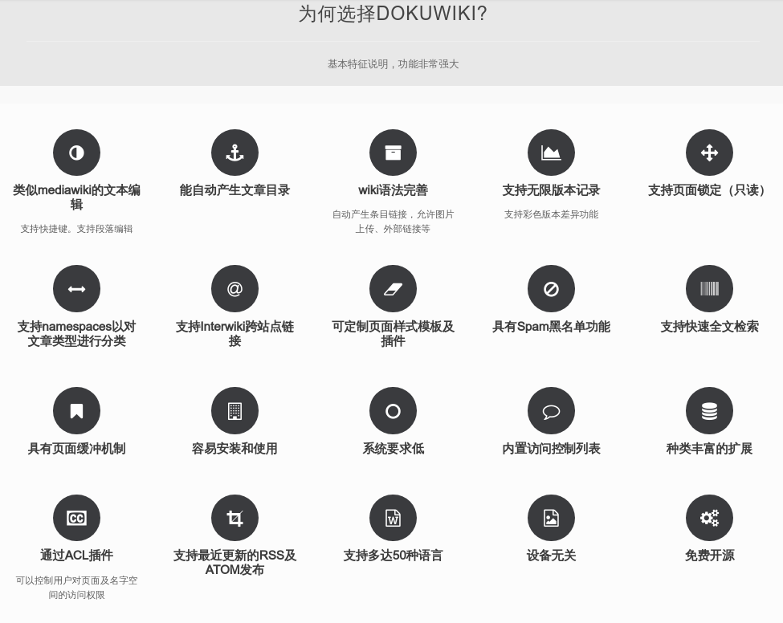
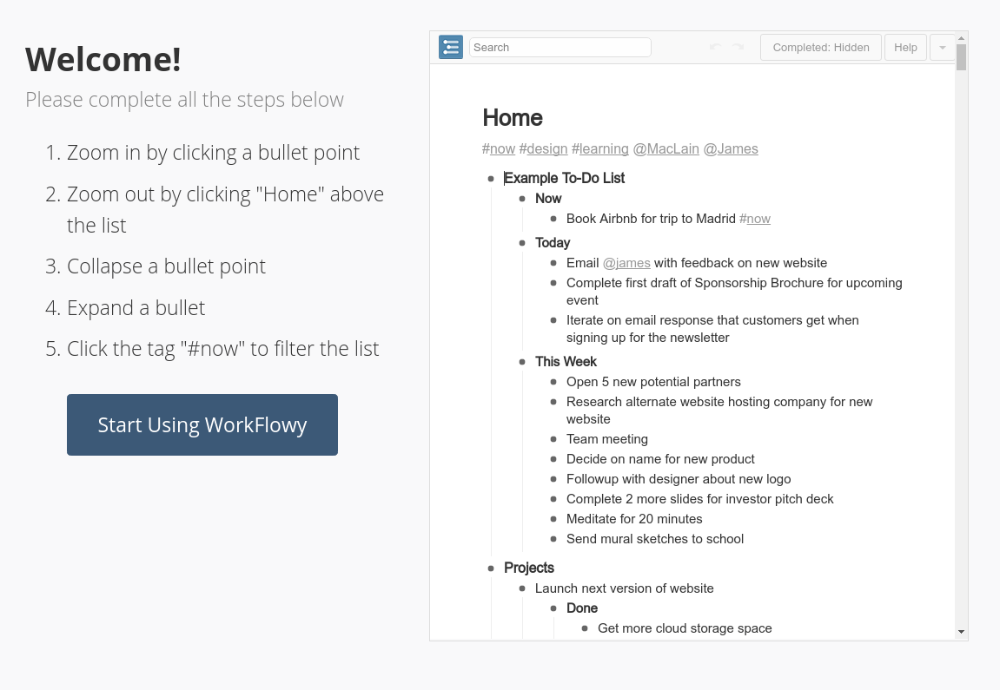
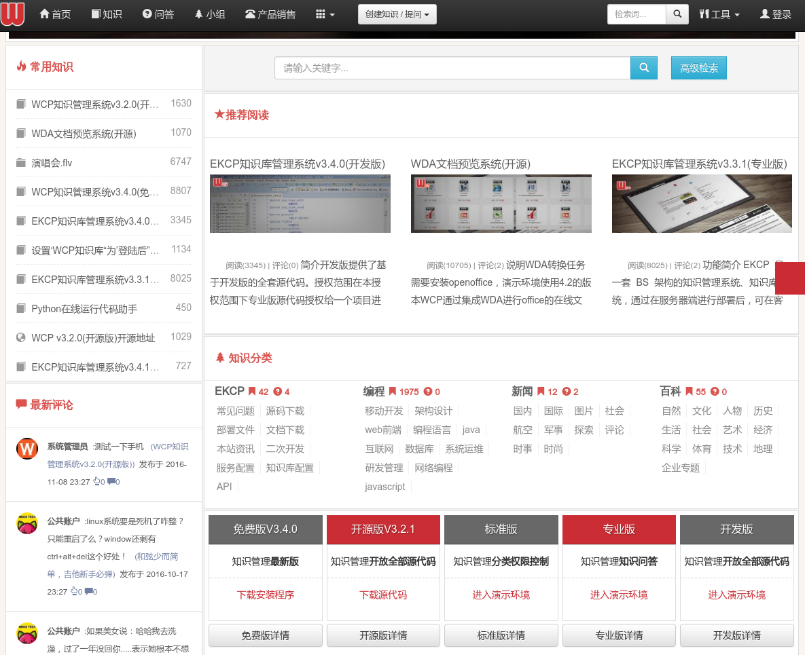
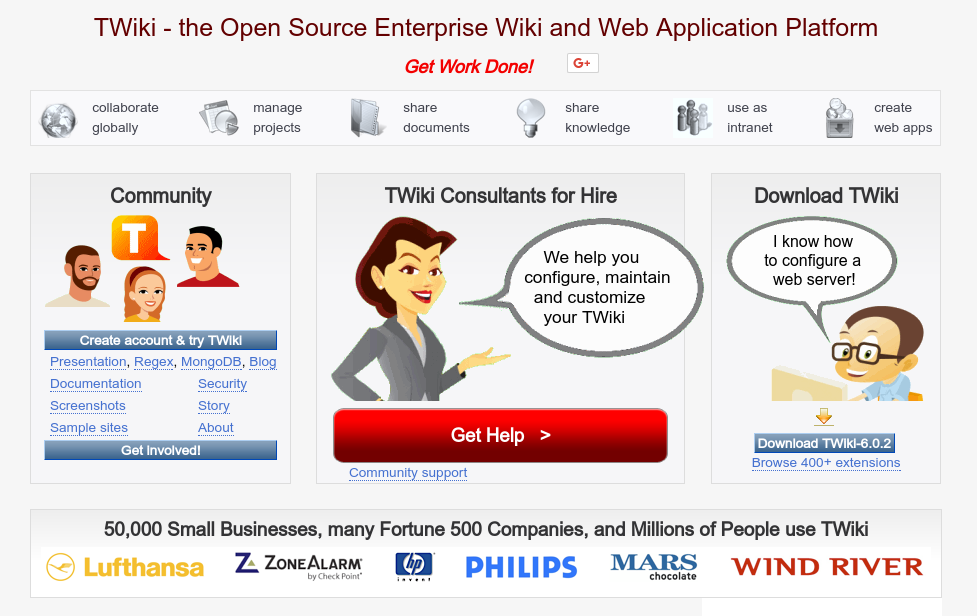
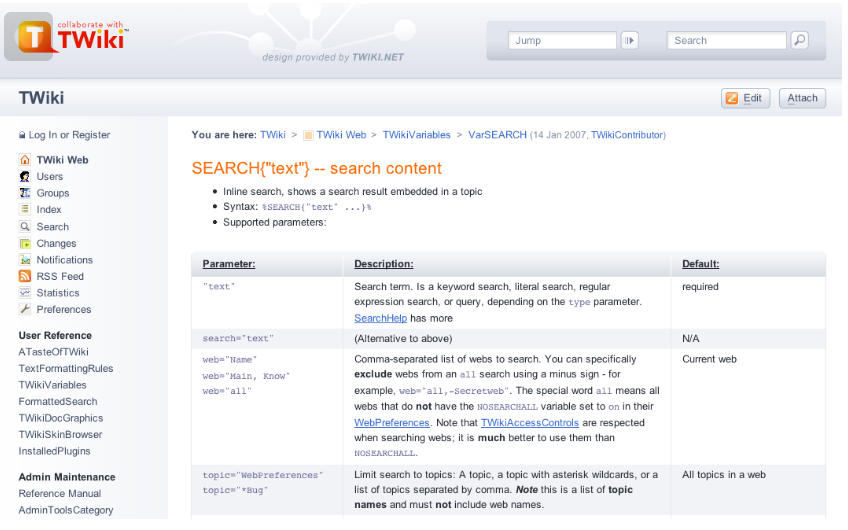
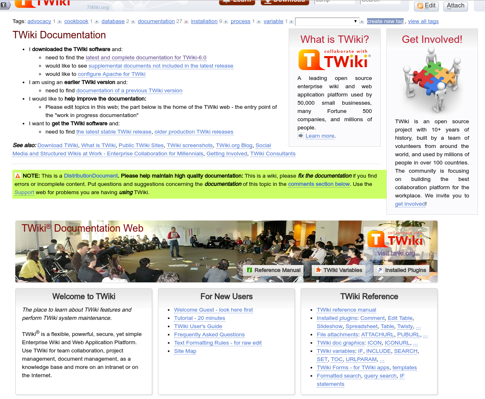

## 能想到的方案:

- Wiki (Gitlab)
  - 简单
  - 可以共享编辑
  - 可以搜索
  - 手动组织层级

- Gitbook 类似的发布页面
  - 美观
  - 样式定制容易
  - 需要专人编写,发布
  - 互动需要在Github/Gitlab上做

- CMS

- Blog

- 专门的知识管理工具

## 搜到的一些开源工具

### [raneto](http://raneto.com/) [Github开源](https://github.com/gilbitron/Raneto)

- Simple
- Flat
- Fast
- `Mustache` for easy templating
- Responsive default template (powered by `Bootstrap`)
- `Highlight.js` code syntax highlighting
- Full-text search powered by `Lunr`
- `GitHub Flavored Markdown`

### dokuwiki 很多人推荐,有不少插件

### WorkFlowy

**Organize Your Brain**

> WorkFlowy is a notebook for lists. Use it to be more creative and productive.

可以参考 [如何玩转 WorkFlowy？](https://www.zhihu.com/question/20491194/answer/87957399)

### [Confluence - atlassian](https://www.atlassian.com/software/confluence) 推荐

- [Community 版本](https://www.alfresco.com/thank-you/thank-you-downloading-alfresco-community-edition)
- [Docker](https://github.com/Alfresco/acs-deployment/blob/master/docs/docker-compose-deployment.md)

Atlassian公司的产品.

> Confluence is content collaboration software that changes how modern teams work

### WCP 功能好像很多的样子

本项目的应用场景是管理技术团队的相关知识（API、代码片段、知识定义、技术经验...） 但是其应用并不局限于这些应用，当然你最好下载一个安装版先试一试。其实这就是一个 知识库、知识管理系统、以及若干基于知识的工具和视图。

（项目同义词：知识库、知识管理、知识发布、文档管理、在线API）

### [alfresco](https://www.alfresco.com/capabilities/document-management) 牛逼闪闪的东西

> Alfresco 提供了开源的企业内容管理系统（ECM），功能包括：文档管理、协作、记录管理、知识库管理、Web内容管理等功能.

### TWiki 感觉也很厉害的样子

> TWiki - the Open Source Enterprise Wiki and Web Application Platform

### 其他的产品

- 一起写
- 石墨
- 有道云协作
- WPS云文档
- 坚果云
- 亿方云

---
Links:

- [史上最全的团队文档协作及管理工具盘点，看看哪款适合你](https://blog.csdn.net/qiansg123/article/details/80127587)
- [哪些软件适合作企业知识管理？](https://www.zhihu.com/question/20227913)

---
END
