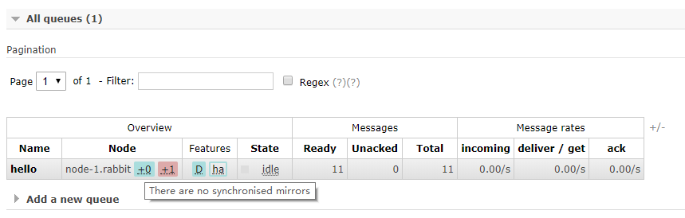
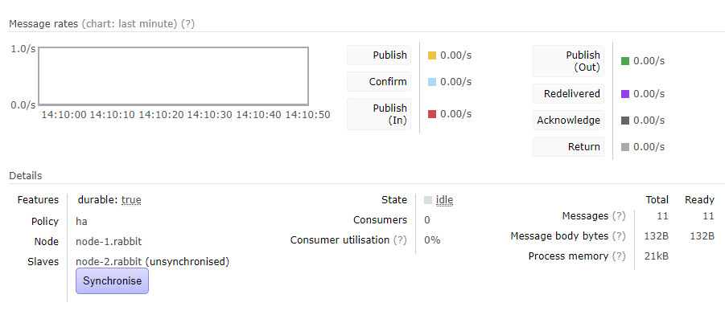

## `docker-compose.xml`

```yaml
version: "2"

services:

  rabbitmq:
    image: rabbitmq:3.6.1-management
    container_name: rabbitmq
    hostname: rabbit80
    restart: always
    environment:
     - RABBITMQ_DEFAULT_USER=root
     - RABBITMQ_DEFAULT_PASS=password
#     - RABBITMQ_ERLANG_COOKIE=xxxxxxxxxxxx
     - RABBITMQ_USE_LONGNAME=true
     - RABBITMQ_LOGS=/var/log/rabbitmq/rabbit.log
    ports:
     - "4369:4369"
     - "5672:5672"
     - "15672:15672"
     - "25672:25672"
     - "35197:35197"
    volumes:
     - /etc/timezone:/etc/timezone
     - $PWD/data/rabbitmq:/var/lib/rabbitmq
     - $PWD/data/rabbitmq/logs:/var/log/rabbitmq
    extra_hosts:
     - "rabbit81:172.16.120.81"
```

## 修改权限

```
chmod 600 erlang.cookie
```

## 创建集群

```
rabbit1$ docker-compose up -d
rabbit2$ docker-compose up -d
rabbit1$ docker exec -it rabbitmq bash
rabbit2$ docker exec -it rabbitmq bash

root@rabbit80:/# rabbitmqctl cluster_status
Cluster status of node rabbit@rabbit80 ...
[{nodes,[{disc,[rabbit@rabbit80]}]},
 {running_nodes,[rabbit@rabbit80]},
 {cluster_name,<<"rabbit@rabbit80">>},
 {partitions,[]},
 {alarms,[{rabbit@rabbit80,[]}]}]

root@rabbit81:/# rabbitmqctl cluster_status
Cluster status of node rabbit@rabbit81 ...
[{nodes,[{disc,[rabbit@rabbit81]}]},
 {running_nodes,[rabbit@rabbit81]},
 {cluster_name,<<"rabbit@rabbit81">>},
 {partitions,[]},
 {alarms,[{rabbit@rabbit81,[]}]}]


root@rabbit81:/# rabbitmqctl  stop_app
Stopping node rabbit@rabbit81 ...
root@rabbit81:/# rabbitmqctl  reset
Resetting node rabbit@rabbit81 ...
root@rabbit81:/# rabbitmqctl  join_cluster rabbit@rabbit80
Clustering node rabbit@rabbit81 with rabbit@rabbit80 ...
root@rabbit81:/# rabbitmqctl  start_app
Starting node rabbit@rabbit81 ...

root@rabbit81:/#  rabbitmqctl set_policy ha-all "^" '{"ha-mode":"all", "ha-sync-mode":"automatic"}'
Setting policy "ha-all" for pattern "^" to "{\"ha-mode\":\"all\"}" with priority "0" ...
root@rabbit81:/#
```

### 发消息

`publish80.py`

```
import pika

credentials = pika.PlainCredentials('xx', 'pwd')
parameters = pika.ConnectionParameters('node1',
                                       5672,
                                       '/',
                                       credentials)
connection = pika.BlockingConnection(parameters)
channel = connection.channel()

channel.queue_declare(queue='hello', durable=True, exclusive=False, auto_delete=False)
channel.basic_publish(exchange='',
                      routing_key='hello',
                      body='Hello World!')
print(" [x] Sent 'Hello World!'")
connection.close()
```

```sh
python message_to_node1.py
python message_to_node2.py
```


## 手动添加删除用户命令

```
# Disabling guest user
docker exec rabbit rabbitmqctl delete_user guest

# Admin user
docker exec rabbit rabbitmqctl add_user josuelima MyPassword999
docker exec rabbit rabbitmqctl set_user_tags josuelima administrator

# Application user
docker exec rabbit rabbitmqctl add_user ruby_app SuperPassword000
docker exec rabbit rabbitmqctl set_permissions -p / ruby_app ".*" ".*" ".*"
```


### 查看消息

```
root@rabbit80:/# rabbitmqctl list_queues
Listing queues ...
hello   2
```


### 关闭启动节点

```
docker exec rabbit rabbitmqctl stop_app
docker exec rabbit rabbitmqctl start_app
```


### determine which mirrors are synchronised with the following rabbitmqctl invocation

```
rabbitmqctl list_queues name slave_pids synchronised_slave_pids
```

### manually synchronise a queue with

```
rabbitmqctl sync_queue name
```

### cancel synchronisation with

```
rabbitmqctl cancel_sync_queue name

```


## 配置自动同步（对于大量消息，自动同步会卡住系统）

- "ha-sync-mode": "automatic"  // default 'manual'

```sh
rabbitmqctl set_policy ha-two "^two\." \
   '{"ha-mode":"exactly","ha-params":2,"ha-sync-mode":"automatic"}'
```

如果不自动同步，一个节点挂掉重启之后需要手动同步列队。

不然会造成消息丢失。






---

- [Configuring Synchronisation](https://www.rabbitmq.com/ha.html#eager-synchronisation)
- [Setting up a RabbitMQ Cluster on Docker](http://josuelima.github.io/docker/rabbitmq/cluster/2017/04/19/setting-up-a-rabbitmq-cluster-on-docker.html)