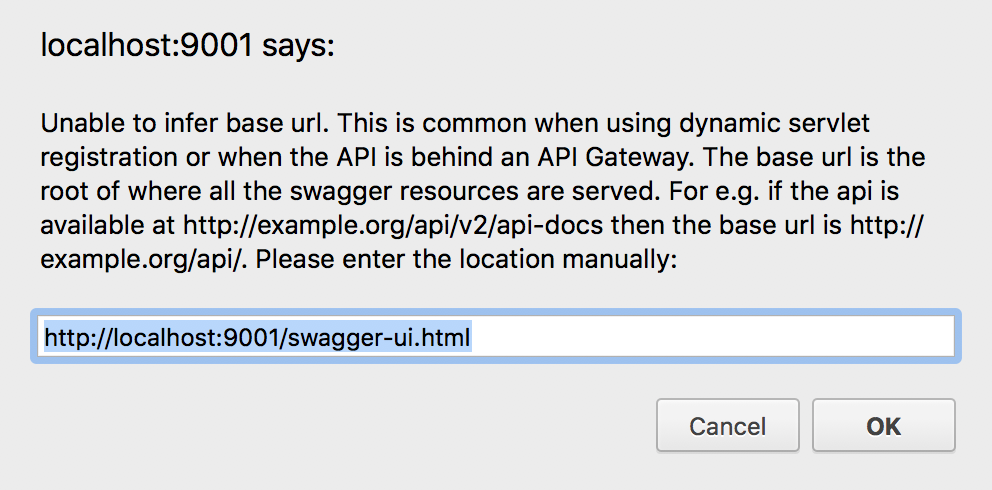

Swagger UI 使用Chrome访问的时候不停的弹框，而使用Safari则没有弹窗的问题：



```
Unable to infer base url. This is common when using dynamic servlet registration or when the API is behind an API Gateway. The base url is the root of where all the swagger resources are served. For e.g. if the api is available at http://example.org/api/v2/api-docs then the base url is http://example.org/api/. Please enter the location manually:
```

后来的后来，不知道改了什么东西，重启了一下。
