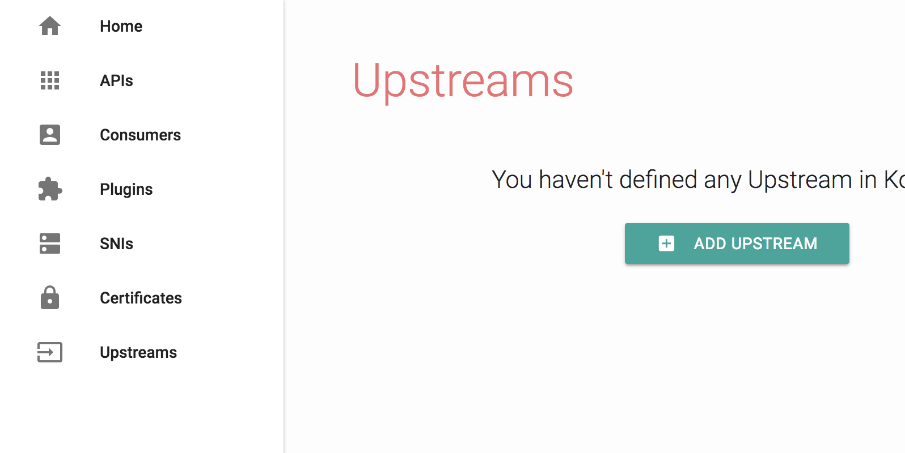

## 1. Link Kong to either a Cassandra or PostgreSQL container

#### Cassandra
```sh
docker run -d --name kong-database \
                -p 9042:9042 \
                cassandra:3
```

or

#### Postgres 
```sh
docker run -d --name kong-database \
                -p 5432:5432 \
                -e "POSTGRES_USER=kong" \
                -e "POSTGRES_DB=kong" \
                postgres:9.5
```

## 2. Prepare your database
```sh
docker run --rm \
    --link kong-database:kong-database \
    -e "KONG_DATABASE=postgres" \
    -e "KONG_PG_HOST=kong-database" \
    -e "KONG_CASSANDRA_CONTACT_POINTS=kong-database" \
    kong kong migrations up
```

## 3 Start Kong
```sh
 docker run -d --name kong \
    --link kong-database:kong-database \
    -e "KONG_DATABASE=cassandra" \
    -e "KONG_CASSANDRA_CONTACT_POINTS=kong-database" \
    -e "KONG_PROXY_ACCESS_LOG=/dev/stdout" \
    -e "KONG_ADMIN_ACCESS_LOG=/dev/stdout" \
    -e "KONG_PROXY_ERROR_LOG=/dev/stderr" \
    -e "KONG_ADMIN_ERROR_LOG=/dev/stderr" \
    -e "KONG_ADMIN_LISTEN=0.0.0.0:8001" \
    -e "KONG_ADMIN_LISTEN_SSL=0.0.0.0:8444" \
    -p 8000:8000 \
    -p 8443:8443 \
    -p 8001:8001 \
    -p 8444:8444 \
    kong:0.12
```
If everything went well, and if you created your container with the default ports, Kong should be listening on your host's `8000` (Proxy), `8443` (Proxy SSL), `8001` (Admin API) and `8444` (Admin API SSL) ports.

## 4. Use Kong with a custom configuration (and a custom Cassandra/PostgreSQL cluster)

You can override any property of the [Kong configuration](https://getkong.org/docs/0.13.x/configuration/) file with environment variables. Just prepend any Kong configuration property with the `KONG_` prefix, for example:

```sh
$ docker run -d --name kong \
    -e "KONG_DATABASE=postgres"
    -e "KONG_PG_HOST=kong-database" \
    -e "KONG_LOG_LEVEL=info" \
    -e "KONG_CUSTOM_PLUGINS=helloworld" \
    -e "KONG_PG_HOST=1.1.1.1" \
    -e "KONG_ADMIN_LISTEN=0.0.0.0:8001" \
    -e "KONG_ADMIN_LISTEN_SSL=0.0.0.0:8444" \
    -p 8000:8000 \
    -p 8443:8443 \
    -p 8001:8001 \
    -p 8444:8444 \
    kong:0.12
```

### Reload Kong in a running container

```sh
docker exec -it kong kong reload
```

### Kong Dashboard
kong-dashboard 暂时只支持 kong 0.12

```sh
docker run --rm -p 8080:8080 --link kong:kong \
  pgbi/kong-dashboard \
  start \
  --kong-url http://kong:8001 \
  --basic-auth user1=password1 user2=password2
```



## Docker Compose
```yml
version: '2.1'

services:

#  kong-database:
#    image: cassandra:3
#    ports:
#      - 9042:9042

  kong-database:
    image: postgres:9.5
    environment:
      - POSTGRES_USER=kong
      - POSTGRES_DB=kong

  kong-migration:
    image: kong:0.12
    depends_on:
      - kong-database
    environment:
      - KONG_DATABASE=postgres
      - KONG_PG_HOST=kong-database
      - KONG_CASSANDRA_CONTACT_POINTS=kong-database
    command: kong migrations up

  kong:
    image: kong:0.12
    depends_on:
      - kong-database
      - kong-migration
    environment:
      - KONG_DATABASE=postgres
      - KONG_PG_HOST=kong-database
      - KONG_PG_DATABASE=kong
      - KONG_ADMIN_LISTEN=0.0.0.0:8001
    ports:
      - 8000:8000
      - 8001:8001
      - 8443:8443
      - 8444:8444

  kong-dashboard:
    image: pgbi/kong-dashboard
    depends_on:
      - kong
    command: start --kong-url http://kong:8001  --basic-auth user1=password1 user2=password2
    ports:
      - 8080:8080
```

---
- https://store.docker.com/images/kong
- https://hub.docker.com/r/pgbi/kong-dashboard/