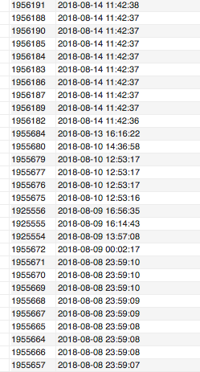
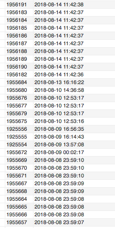

项目遇到一个问题，分页的时候第一页和第二页数据有重复。最后经过排查发现是 `order by` 相同的timestamp引起的。

我们的查询语句为：

```sql
- 默认缓存查询语句
SELECT id, created FROM order_header ORDER BY created DESC LIMIT 0, 100
- 后面的查询
SELECT id, created FROM order_header ORDER BY created DESC LIMIT 100, 900
```

`created`是创建时间的`TIMESTAMP`，由于在同一时间有很多订单进来，最后的查询结果为：



可以发现同一时间的数据排序是随机的，这样上面两个查询的数据就可能重复。

更新sql为：

```sql
SELECT id, created FROM order_header ORDER BY created DESC, 1 DESC LIMIT 0, 100 
```

可以看到数据按照插入数据库的顺序倒序排列了，


同理使用` ORDER BY 1 ASC`可达到如下效果：




关于为什么同样条件的顺序是随机的，网上有如下的说法：

```
I'd advise against making that assumption. In standard SQL, anything not required by an explicit ORDER BY clause is implementation dependent.

I can't speak for MySQL, but on e.g. SQL Server, the output order for rows that are "equal" so far as the ORDER BY is concerned may vary every time the query is run - and could be influenced by practically anything (e.g. patch/service pack level of the server, workload, which pages are currently in the buffer pool, etc).
```

---
- [How mysql order the rows with same values](https://stackoverflow.com/questions/6662837/how-mysql-order-the-rows-with-same-values)