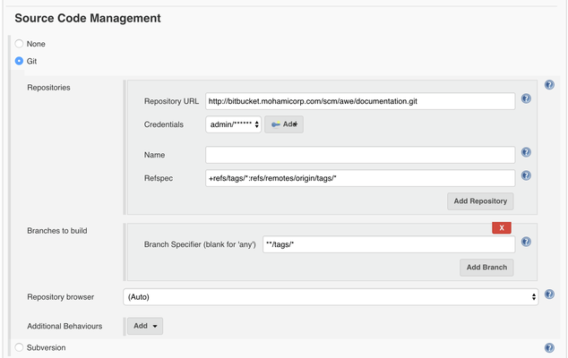

## Configure Bitbucket Server
Make sure  `Advanced Configuration > Branch Options > Build All` is selected. This will skip the whitelist and blacklist checks so that all new commits and tags send the required Jenkins notification.

## Set up a Jenkins Job for Tags
In the job set `refspec` to `+refs/tags/*:refs/remotes/origin/tags/*`. Set the branch specifier to `**/tags/**`. This will configure the job so it only responds to new tags.

----
- https://mohamicorp.atlassian.net/wiki/spaces/DOC/pages/136740885/Triggering+Jenkins+Based+on+New+Tags