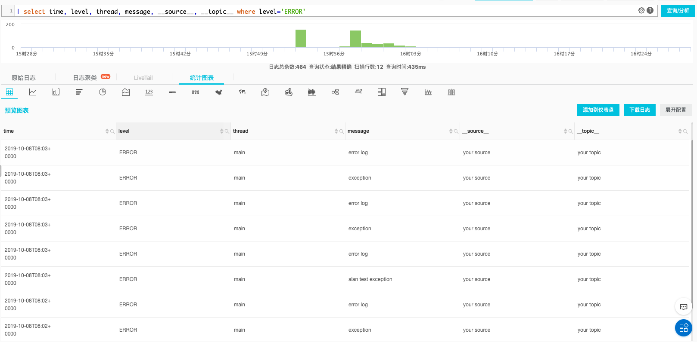
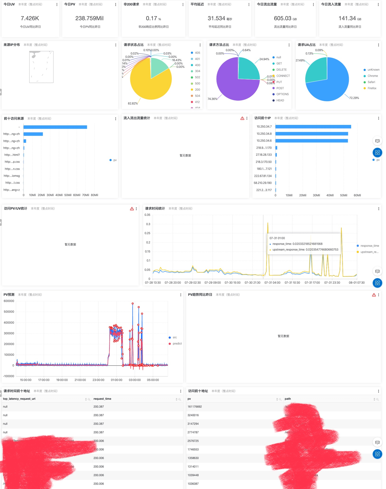
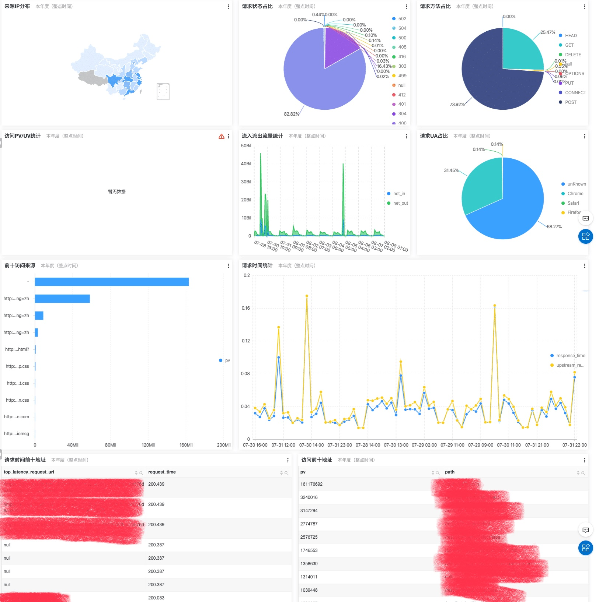

之前使用阿里云的[日志服务SLS](https://sls.console.aliyun.com/lognext/profile)分析过 Nginx 的请求日志，由于内置的 Nginx 模板和 SQL 查询都
很实用，现在将 Logback 和 SLS 也结合一下。

使用起来很简单，Aliyun 在 [Github](https://github.com/aliyun/aliyun-log-logback-appender) 有维护 Logback 的 Appender，按照说明
使用即可。

首先添加依赖：
```groovy
dependencies {
    compile "com.google.protobuf:protobuf-java:${protobufVersion}",
        "com.aliyun.openservices:aliyun-log-logback-appender:${aliyunLogLogbackVersion}"
}
```

版本没有使用文档推荐的，而是使用官网最新的：

```ini
aliyunLogLogbackVersion=0.1.15
protobufVersion=3.10.0
```

`logback.xml` 里面添加 appender（这里只是配置片段，完整配置可自行补充或者参考官网 Demo）：
```xml
<configuration>
 <!-- To prevent data loss when the process exits, please remember to add this configuration -->
  <shutdownHook class="ch.qos.logback.core.hook.DelayingShutdownHook"/>

  <appender name="aliyun" class="com.aliyun.openservices.log.logback.LoghubAppender">
    <!-- Required parameters -->
    <!-- Configure account and network  -->
    <endpoint>your project endpoint</endpoint>
    <accessKeyId>your accesskey id</accessKeyId>
    <accessKeySecret>your accesskey</accessKeySecret>

    <!-- Configure sls -->
    <project>your project</project>
    <logStore>your logStore</logStore>
    <!-- Required parameters(end) -->

    <!-- Optional parameters -->
    <topic>your topic</topic>
    <source>your source</source>

    <!-- Optional parameters -->
    <totalSizeInBytes>104857600</totalSizeInBytes>
    <maxBlockMs>60000</maxBlockMs>
    <ioThreadCount>8</ioThreadCount>
    <batchSizeThresholdInBytes>524288</batchSizeThresholdInBytes>
    <batchCountThreshold>4096</batchCountThreshold>
    <lingerMs>2000</lingerMs>
    <retries>10</retries>
    <baseRetryBackoffMs>100</baseRetryBackoffMs>
    <maxRetryBackoffMs>100</maxRetryBackoffMs>
    
    <!-- Optional parameters -->
    <encoder>
        <pattern>%d %-5level [%thread] %logger{0}: %msg</pattern>
    </encoder>
    
    <!--  Optional parameters -->
    <timeFormat>yyyy-MM-dd'T'HH:mmZ</timeFormat>
    <!--  Optional parameters -->
    <timeZone>UTC</timeZone>
  </appender>

  <!-- This listener will print the status in StatusManager to console
  <statusListener class="ch.qos.logback.core.status.OnConsoleStatusListener"/>
  -->


    <root level="INFO">
        <appender-ref ref="aliyun"/>
    </root>
</configuration>
```

调整配置里面的相关变量，即可在程序里面使用。


```groovy
private static final Logger logger = LoggerFactory.getLogger(Application.class);

...

logger.trace("trace log");
logger.debug("debug log");
logger.info("info log");
logger.warn("warn log");
logger.error("error log");
logger.error("test exception", new RuntimeException("my exception"))
```

设置好`查询分析属性`，运行程序。

即可使用阿里云的控制台进行日志日志查询了，比如编写查询语句（如果要查询详细信息，增加查询字段`log`即可）：

```sql
| select time, level, thread, message, __source__, __topic__ where level='ERROR'
```




最后附上两个日志服务附带的 Nginx Dashboard 截图：





