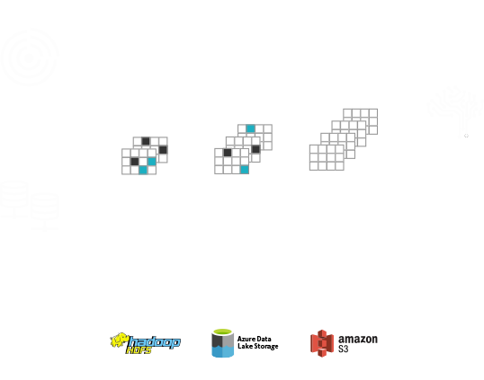
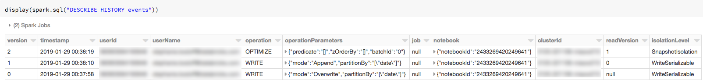

去年一次听 AWS 的技术分享，听说了 Data Lake 的概念。如今最为流行的数据湖解决方案就是 Databricks 的 Delta Lake 了。其他的数据库解决方案，
比如 Apache 的 Iceberg，以后有时间再学习下，最近集中学习下 Delta。

Delta 是 Spark 的母公司 Databricks 在 2019 年 Spark Summit 大会上开源的。[官网](https://databricks.com/product/delta-lake-on-databricks)
的宣传是 `Brings data reliability and performance to your data lakes` 可见其官方的卖点是数据可靠性和性能。

下面的整体架构说明 Delta 旨在现在的数据库方案上来解决现在数据库的痛点。



他提供了如下特性：

- ACID 事务
- DML API 更新、合并和删除数据集
- 时间旅行：数据版本和快照
- 可扩展的元数据管理
- 开放的数据格式
- 统一批处理、流处理和数据下沉
- 模式演进
- 审批历史
- 100% 兼容 Spark Api

## 快速开始

### 建表

和 Spark SQL 一样，只需要将格式从 `parquet`, `csv`, `json` 转成 `delta` 就行了。

```python
events = spark.read.json("/databricks-datasets/structured-streaming/events/")
events.write.format("delta").save("/mnt/delta/events")
spark.sql("CREATE TABLE events USING DELTA LOCATION '/mnt/delta/events/'")
```

上面的操作就使从 JSON 数据里获取 Schema 创建了一个受管理的表。

### 数据分割

为了提高查询效率，可以指定一列或者多列来进行数据分割

```python
Copy to clipboardCopy
events = spark.read.json("/databricks-datasets/structured-streaming/events/")
events.write.partitionBy("date").format("delta").save("/mnt/delta/events")
spark.sql("CREATE TABLE events USING DELTA LOCATION '/mnt/delta/events/'")
```

### 修改表

Delta 支持丰富的改表操作

#### 流写入

```python
from pyspark.sql.types import *

inputPath = "/databricks-datasets/structured-streaming/events/"

jsonSchema = StructType([ StructField("time", TimestampType(), True), StructField("action", StringType(), True) ])

eventsDF = (
  spark
    .readStream
    .schema(jsonSchema) # Set the schema of the JSON data
    .option("maxFilesPerTrigger", 1) # Treat a sequence of files as a stream by picking one file at a time
    .json(inputPath)
)

(eventsDF.writeStream
  .outputMode("append")
  .option("checkpointLocation", "/mnt/delta/events/_checkpoints/etl-from-json")
  .table("events")
)
```

### 批插更

使用 `MERGE INTO` 合并（插入或更新）数据到已存在的表。

```sql
MERGE INTO events
USING updates
ON events.eventId = updates.eventId
WHEN MATCHED THEN
  UPDATE SET
    events.data = updates.data
WHEN NOT MATCHED
  THEN INSERT (date, eventId, data) VALUES (date, eventId, data)
```

注意： 插入的时候要指定表中的所有数据。

### 访问

可以通过 DBFS 的路径或者表名来访问

```python
val events = spark.read.format("delta").load("/mnt/delta/events")
```

or
```python
val events = spark.table("events")
```

### 显示表历史

通过 `DESCRIBE HISTORY`



### 使用时间旅行查询早版本的数据

比如
 
- 版本0 是在 `2019-01-29 00:37:58`
- 版本1 是在 `2019-01-29 00:38:10`

查询版本0：

```sql
SELECT * FROM events VERSION AS OF 0
```
or
```sql
SELECT * FROM events TIMESTAMP AS OF '2019-01-29 00:37:58'
```

NOTE: 只要在 '2019-01-29 00:37:58' to '2019-01-29 00:38:09' 内的时间都可以查询到版本0.

```python
df1 = spark.read.format("delta").option("timestampAsOf", timestamp_string).load("/mnt/delta/events")
df2 = spark.read.format("delta").option("versionAsOf", version).load("/mnt/delta/events")
```

### 优化表

多次操作之后会产生很对小文件，优化表可提升性能。

```sql
OPTIMIZE delta.`/mnt/delta/events`
```

or

```sql
OPTIMIZE events
```

### Z-Order

为了更一步提升性能可以指定一列来帮助定位数据，

```sql
OPTIMIZE events
  ZORDER BY (eventType)
```

### 快照清理

Delta 对不同版本数据进行了隔离，所以我们推荐`OPTIMIZE`，但是如果这的要清理快照可以用`VACUUM`命令

```sql
VACUUM events
```
or
```sql
VACUUM events RETAIN 24 HOURS
```
