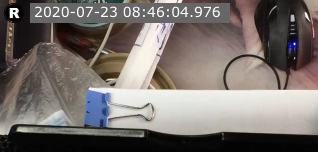

RecordRtc 录像保存的视频需要添加录像时间等信息。

前端方案就是录制的时候直接写进视频对象（Canvas），后端方案是视频保存的时候保存相关信息进数据库，再用 FFMPG 等工具进行视频处理。

RecordRTC 网页上有前端加 Logo 的例子，稍微改造了下，效果如下：

<<< @/blogs/2020/07/resources/recordrtc-draw-image-and-text.html

参考：

- [Record RTC](https://recordrtc.org/)
- [Draw Text on canvas in HTML5](http://www.authorcode.com/draw-text-on-canvas-in-html5/)
- [HTML5 Canvas Text](http://tutorials.jenkov.com/html5-canvas/text.html)
- [30+ Simple Demos using RecordRTC](https://www.webrtc-experiment.com/RecordRTC/simple-demos/)
- [Show logo+advertisement on the recorded video | RecordRTC](https://www.webrtc-experiment.com/RecordRTC/simple-demos/show-logo-on-recorded-video.html)
