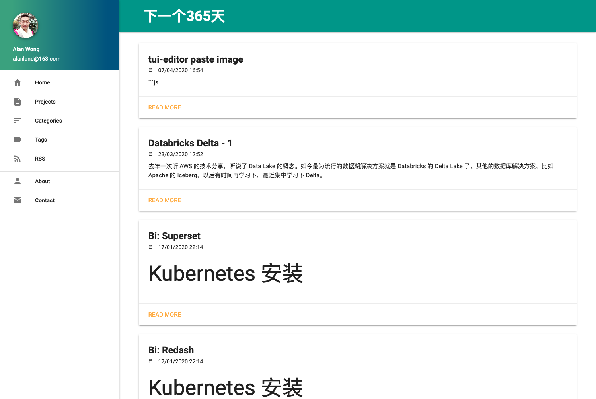
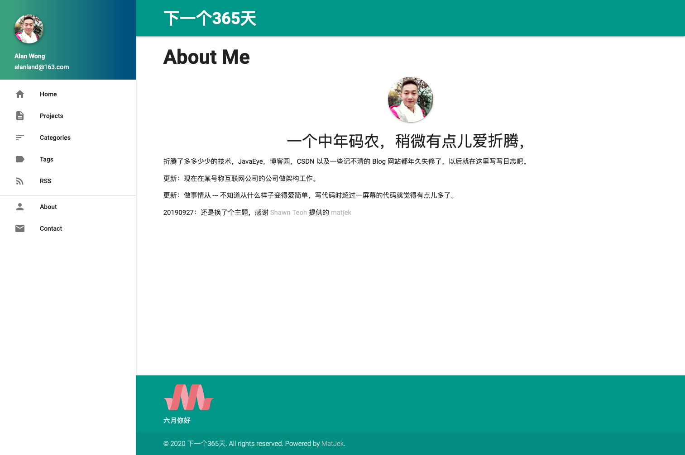
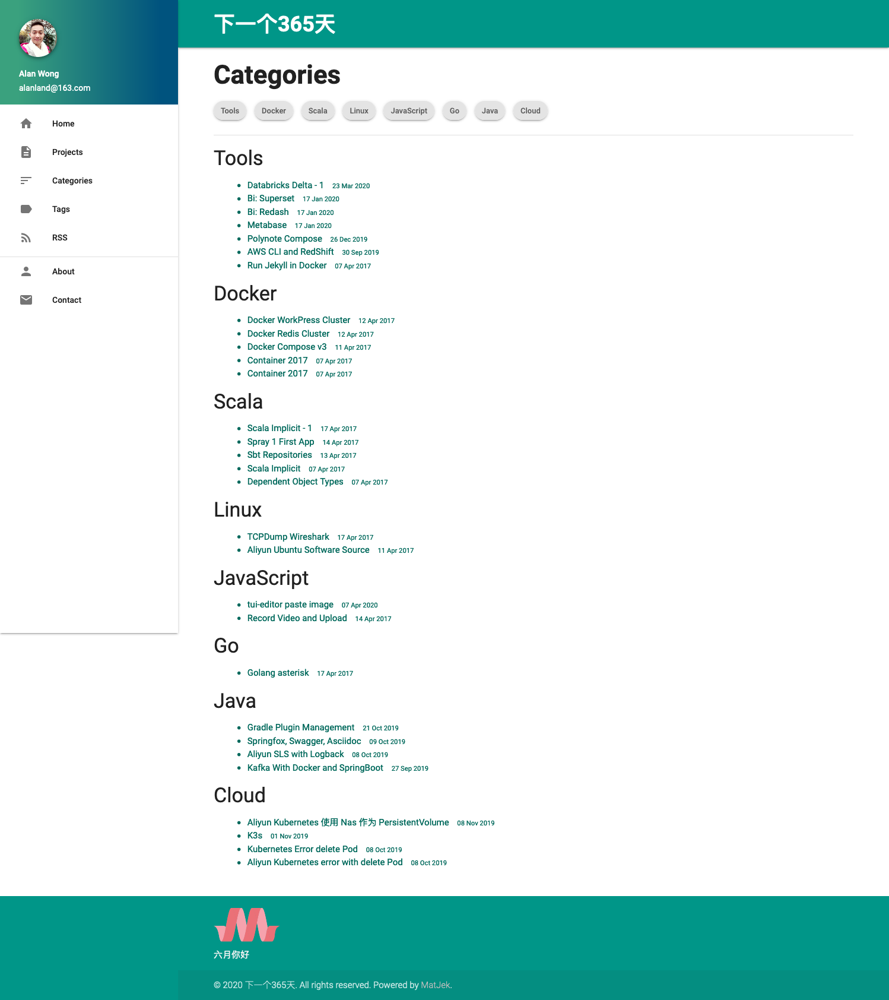
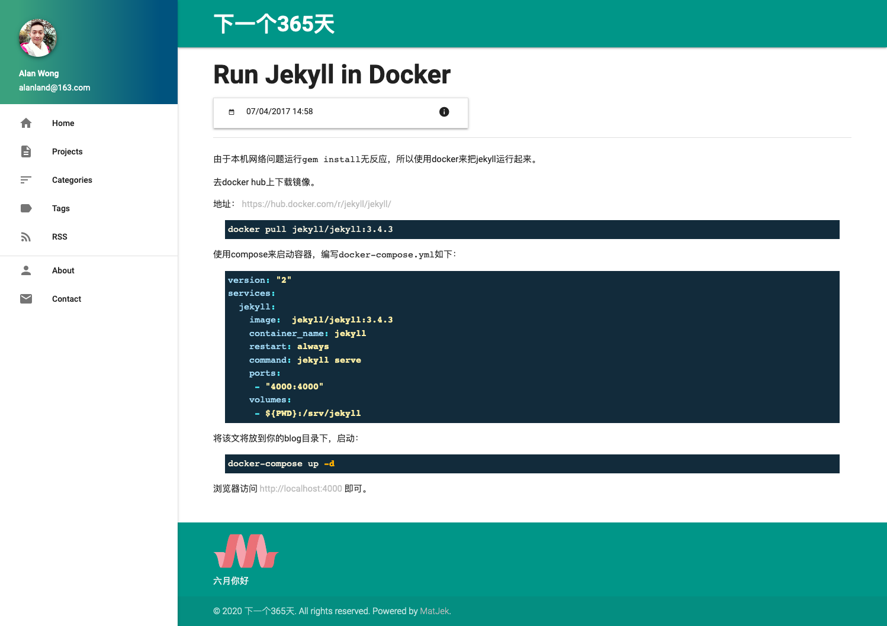
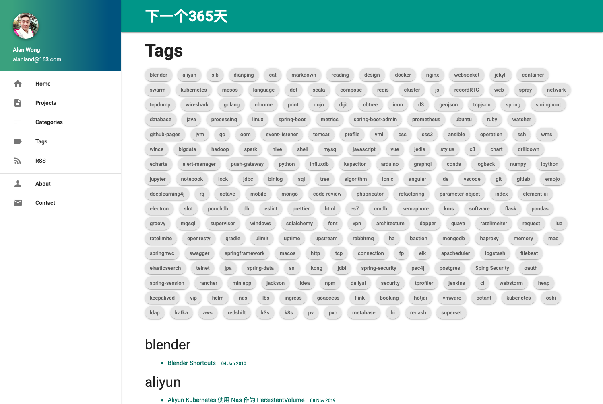

之前的系统是 Jekyll，也是GitPages推荐的书写工具。但是当时所有文章都放在Posts目录里面，已经有100多篇了，特别不方便。

去年的文档系统从 GitBook1.x 升级到 VuePress，对 VuePress 有一定了解，准备升级到 VuePress，同时感谢 theme-reco 的开源主题。

## 升级过程

我的迁移过程是，

- 初始化一个 VuePress 项目
- 配置好对应的主题，运行起来
- 把原始文章迁移过来
- 把图片等资源迁移过来
- 检查

:::tip vuepress默认不支持 markdown 后缀                                                
文件不是特别多，我就把原来 markdown 的文件改成了 md 的后缀
:::

:::tip 部分文件不显示
首先发现有些文章没有配置 categories 就不显示。我先把这些文章的分类配置了。
:::

## 之前的版本留念

### 首页

### 关于

### 分类

### 文章

### 标签

## 一些好玩儿的主题

- https://diygod.me/handshake/#more
- https://nyakku.moe/posts/2019/10/21/moefy-your-vuepress-blog.html
- https://moefyit.github.io/moefy-vuepress/
- https://lovelijunyi.gitee.io/posts/c898.html