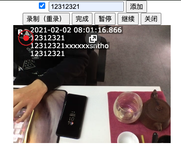

之前 WebRTC 录像添加图片和时间的例子，移植的时候 recorder 对象的 blob 获取不到，重写了例子，提供了几个方法：

```js
start() // start / restart
stop() // stop and save
pause() // 
resume() //
close() // close camera
```



<<< @/blogs/2021/02/2021-02-02-recordrtc-add-text-and-save.md

