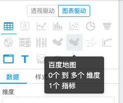

## 下载项目

可参考[文档](https://edp963.github.io/davinci/docs/zh/1.1-deployment)

## 前端
前端安装，使用`yarn`安装出错，未关心其原因，后使用 cnpm 安装。

```
[4/5] 🔗  Linking dependencies...
[5/5] 🔨  Building fresh packages...
[8/13] ⠈ pngquant-bin
[6/13] ⠈ mozjpeg
[9/13] ⠈ cwebp-bin
[7/13] ⠈ optipng-bin
error /Users/.../davinci/webapp/node_modules/gifsicle: Command failed.
Exit code: 1
Command: node lib/install.js
Arguments:
Directory: /Users/.../davinci/webapp/node_modules/gifsicle
Output:
⚠ connect ECONNREFUSED 0.0.0.0:443
  ⚠ gifsicle pre-build test failed
  ℹ compiling from source
  ✖ Error: Command failed: /bin/sh -c autoreconf -ivf
/bin/sh: autoreconf: command not found
```

使用 `cnpm start` 启动访问 [ http://localhost:5002]( http://localhost:5002)，由于没有后端，过了很久之后出现登录界面。


## 后端

### 配置环境变量

```
export DAVINCI3_HOME=~/app/davinci/davinci-assembly_3.0.1-0.3.0-SNAPSHOT-dist
```

### 创建数据库并导入数据
```
mysql -P 3306 -h localhost -u root -proot davinci0.3 < $DAVINCI3_HOME/bin/davinci.sql
```
或者执行脚本初始化数据库：
```
sh bin/initdb.sh
```

然后修改 `davinci/config/application.yml` 的数据库链接。

### 修正JDK版本

运行程序提示
```
/Users/.../davinci/server/src/main/java/edp/core/utils/FileUtils.java:23:32
java: package com.sun.image.codec.jpeg does not exist
```
`com.sun.image.codec.jpeg` 已经在 java 7 中移除，

修改
```java
JPEGImageEncoder encoder = JPEGCodec.createJPEGEncoder(output);
encoder.encode(img_dest);
```
为：
```java
assert img_dest != null;
ImageIO.write(img_dest, "jpeg", output);
```
去掉这两个引用。

### 其他错误

#### 类找不到

```
NoClassDefFoundError: Could not initialize class org.hibernate.validator.internal.engine.valueextraction.ValueExtractorManager
```
初步判定是依赖问题，为了以后二次开发方便，把常用的库都升级到最新版本：

```
springboot: 2.4.3
spring-boot-starter-oauth2-client: 2.4.3
druid； 1.2.5
mybatis-spring-boot-starter: 2.1.4
```
增加 `org.springframework.boot:spring-boot-starter-validation` 的依赖。

### 启动

默认用户是 guest/123456，也可以新建一个用户。（如果不想配置邮件服务可以修改 CheckConfigRunner 的逻辑）

登录 `http://localhost:5002/` 即可以访问。

## 测试开发

参考 [diss带码](https://dumplingbao.github.io/2020/03/19/davinci-dev-bmap/) 的教程，做一个开发试试

index.html
```html
<script type="text/javascript" src="//api.map.baidu.com/api?type=webgl&v=1.0&ak=您的密钥"></script>
```

davinci/webapp/app/containers/Widget/config/chart/bmap.ts
```tsx
const map: IChartInfo = {
  id: ChartTypes.BMap,
  name: 'bmap',
  title: '百度地图',
  icon: 'icon-china', // 图标先用原来的中国地图
  coordinate: 'cartesian',
  rules: [{ dimension: [0, 9999], metric: 1 }],
  dimetionAxis: 'col',
  ...
}
```

ChartTypes.ts
```js

  /**
   * 百度地图
   */
  BMap = 18
```
`davinci/webapp/app/containers/Widget/config/chart/index.tsx`增加 bmap 的引用，并添加到 chart 对象里面。

刷新应用就可以看到我们的类型里面增加了百度地图， 

