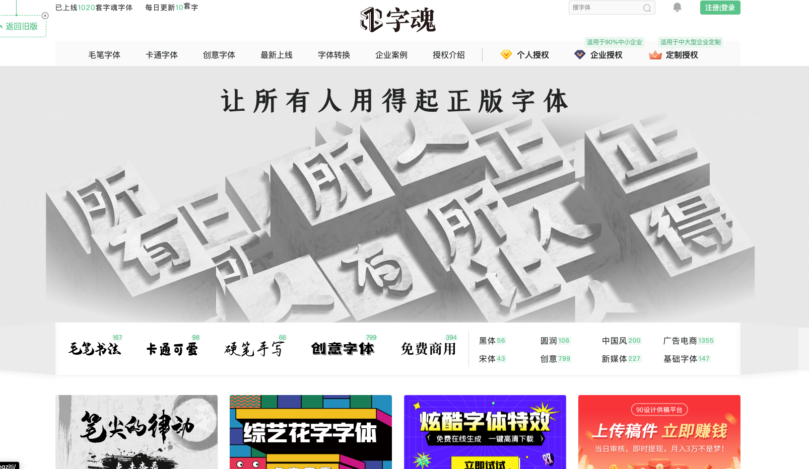
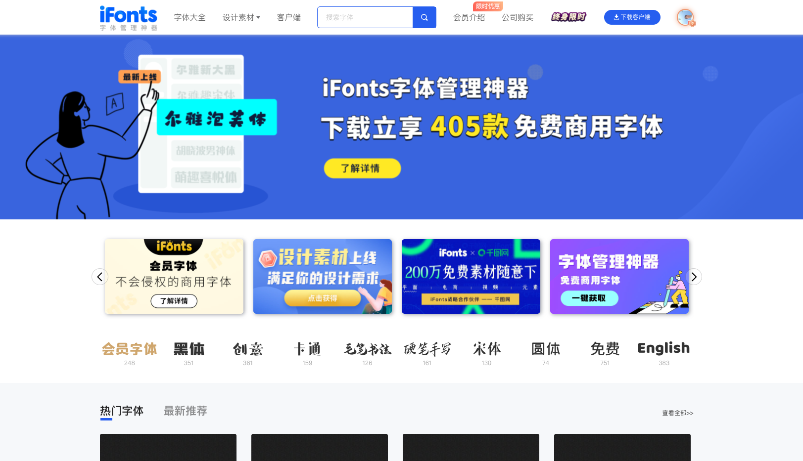
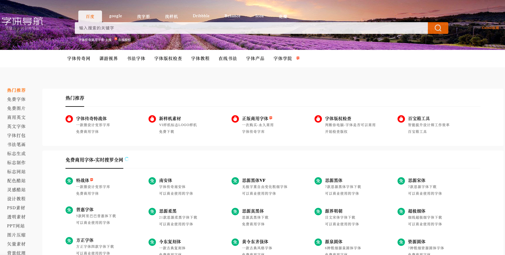

## 字体网站

### [360 查字体](https://fonts.safe.360.cn/)

网站现在不能用了

### [求字体](https://www.qiuziti.com/)

有 Windows 的字体助手，可以查询、上传图片识别字体。

### [字由](https://www.hellofont.cn/home)

有 Mac 客户端，字体设计网站。

### [字魂](https://izihun.com/)

有客户端，很早就安装了。

### [iFonts](https://51ifonts.com/)

客户端和字魂很像，不知道是不是一家。

### [字体导航](https://hao.ziticq.com/)

很多免费商用的字体，还有一些别的设计资源。

## 几个常见的英文字体

### Inconsolata 

免费字体。

### Consolas

微软的字体。

### Deja Vu Sans Mono

免费字体。

### Droid Sans Mono

---
- https://blog.csdn.net/sduvec/article/details/12617119
