搜索增长SaaS的时候，看到一篇讲 2B、2C 混合增长的文章，对SaaS模式有个新的认识。

## 第二增长曲线

### 不只是 PLG（Product-led Growth）

我们认为产品导向型增长可能才是SaaS成功的关键，比如（Zoom，Slack），但也只是一部分：

- Atlassian 如今的销售和管理开支大约5亿美金，占收入的大约40%
  - 前期可能真的没有销售（产品导向型增长），到如今的销售投入，即第二个十年，从一亿到12亿，打法已经
    发生了很大变化。
- Zoom、Slack 在病毒式增长之后，也都在扩大了销售团队。

其它一些采用混合增长方式的公司：

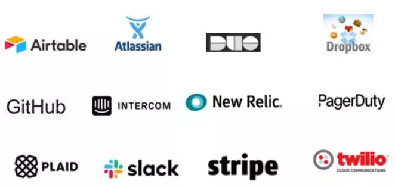

普通人的逻辑会认为，2C 和 2B 的逻辑无法兼容，就是2C的成功，并不能抓住2B的痛点，无法解决2B的问题。
而一个方案是，以解决2B的C（终端用户）的刚需和痛点，通过产品驱动的方式来完成 2B 2C 的两条曲线。

### 产品和销售，两条线增长

对产品来说，应该贴近终端用户、把系统做的更简单；产品设计也是为了终端用户，而不是高管买单或者卖弄专业复杂度。

### SaaS是你愿景的载体

不要为了 SaaS 而 SaaS，SaaS只是一个产品形式、一个生意，是你想做事情的载体。

SaaS 也不应该影响非SaaS的收入，不应影响人力密集的交付和专业的咨询，这些都是商业模式的一部分和必须。

可以2C开场，然后2小B，再 To 大B，或者几条线齐头并进，互为依托。

> 都需要积极考虑如何加入 C 端的元素。

## 关于SaaS
SaaS增长的指标，国内SaaS今年增长很快。
美国先天和后天的优势，首先市场大时间久，已经总结了大量的方法论，其次，美国用户乐于付费，再小的细分
服务，只要做得好，也能找到市场。就比如，之前看到有一个月费几千美金的炫富APP一样，竟然也拥有你想象
不到的成功。

随着越来越多的SaaS公司上市，我们也看到了2B变现模式和2C增长模式融合的更多可能性。

关于SaaS方法论，国外有很多值得我们借鉴的地方，同时也有很多相关的数据进入我们的视野，比如我们耳熟能详
的《增长黑客》。

SaaS上市公司：
- Salesforce
- Workday
- ServiceNow
- Square
- Atlassian
- Shopify
- Veeva Systems
- Twilio
- Dropbox
- Slack
- Zoom
- LinkedIn

## SaaS 面临的问题

SaaS的增长速度决定了颠覆传统软件的速度。国内 SaaS 如今面临的问题：

- 竞争愈发激烈
- 客户自研的能力和医院越来越强
- 客户越来越在意解决方案
    客户要的并不是软件，而软件也一定能解决客户的问题。
- 更大的基于在下沉市场
    中小企业付费能力不足的很大原因是并不能给中小企业带来「直接可见」的收益。

## Product-led Growth 产品导向型增长

Product-led Growth 是海盗模型 AARRR 的一个自然延伸，和传统 SaaS 营销和销售驱动增长不同，
它强调通过产品本身驱动增长。

《Product-led Growth Collective》 一文介绍了产品驱动增长的七个指标。
> 这些指标的价值在于提供通用的、可量化的目标，帮助每一个部门了解和优化用户绿城，以此驱动企业增长。

### Align 协作

产品导向型增长要求团队协作，并受益于团队协作。

### 增长飞轮

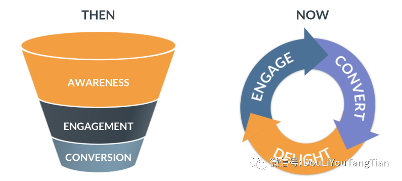

「漏斗」把用户旅程看做一条从认知到营收的直线，并不适合实现以产品驱动增长。

产品导向增长飞轮是通过「投资产品的用户体验」来发展业务的框架。

设计了四个连续的细分用户群：
- 注册用户
- 试用用户
- 付费用户
- 粉丝用户

以及用户进入下一阶段所需的关键动作：
- 激活
- 转化
- 培育
- 拥护

公司和团队通过优化用户体验，来将用户转移到下一个阶段：

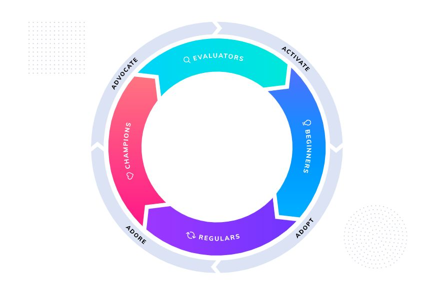

### 海盗指标框架

指标：
- 获客
- 激活
- 营收
- 留存
- 推荐

## 产品导向型增长的七个指标

### 1. 价值实现时间 TTV
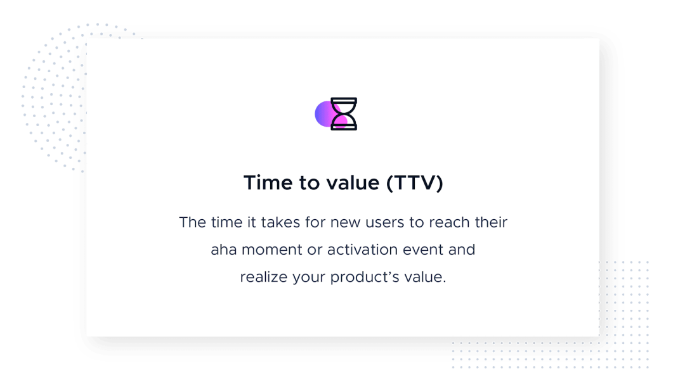

新用户达到其第一个「aha moment」或激活事件所花费的时间

### 2. 产品合格线索 PQL

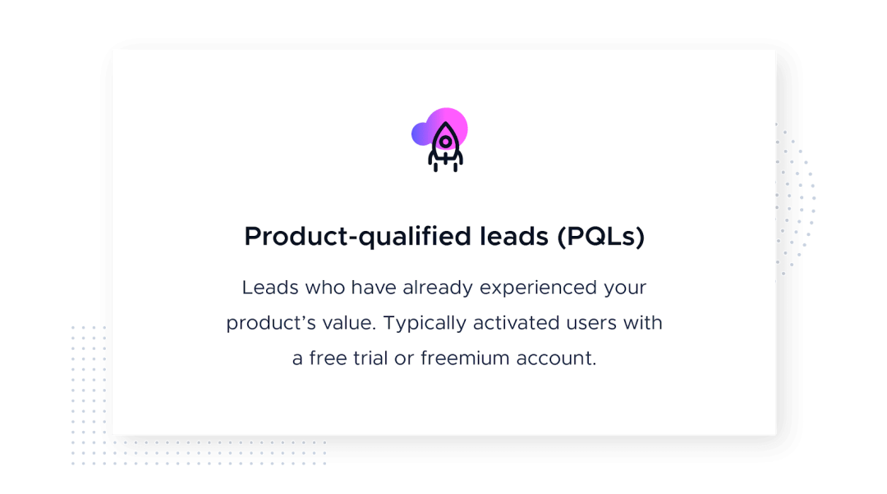
 
指已激活用户，即完成关键步骤、拥有「aha moment」，并可以直接看到产品价值的人。

### 3. 扩增收入 扩增MRR

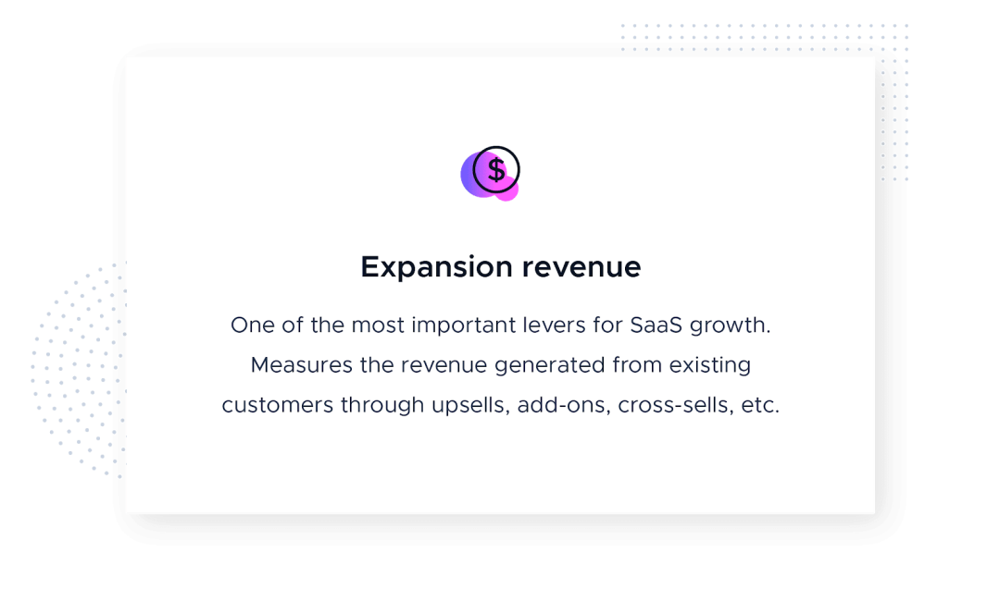

衡量对现有客户进行增售、附加功能销售、交叉销售等所产生的收入。

### 4. 平均每付费用户收入 ARPU

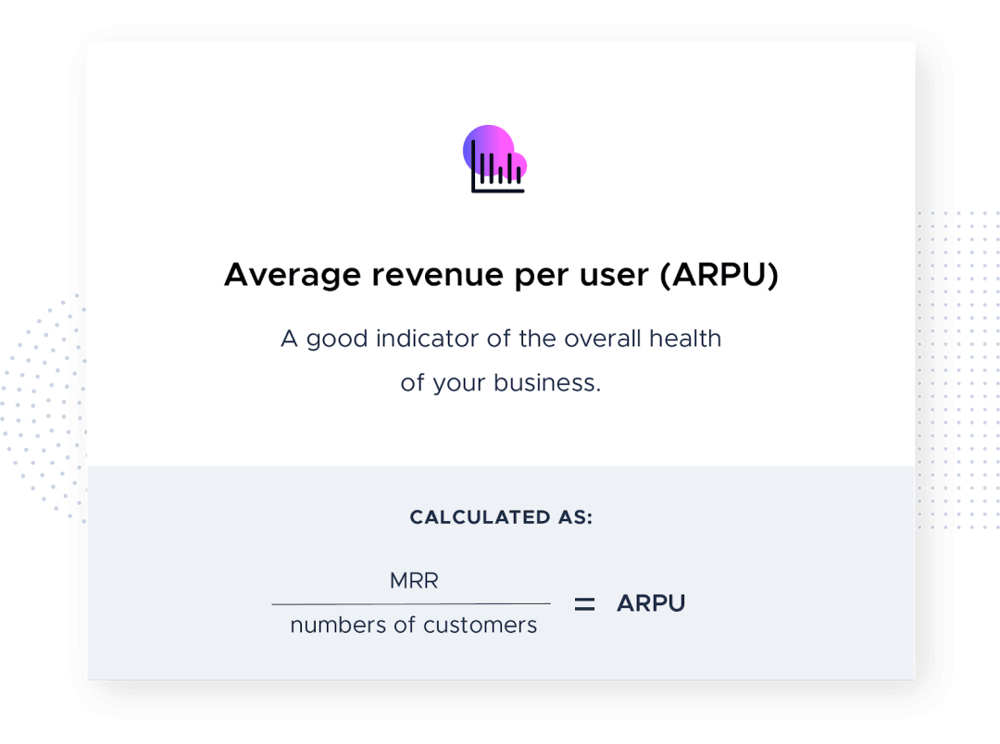

从单个用户获得的平均收入。总MRR除以用户总数即可。

> 在其它所有条件都相同的情况下，ARPU 较高的公司更有利可图。

### 5. 客户生命周期价值 CLV

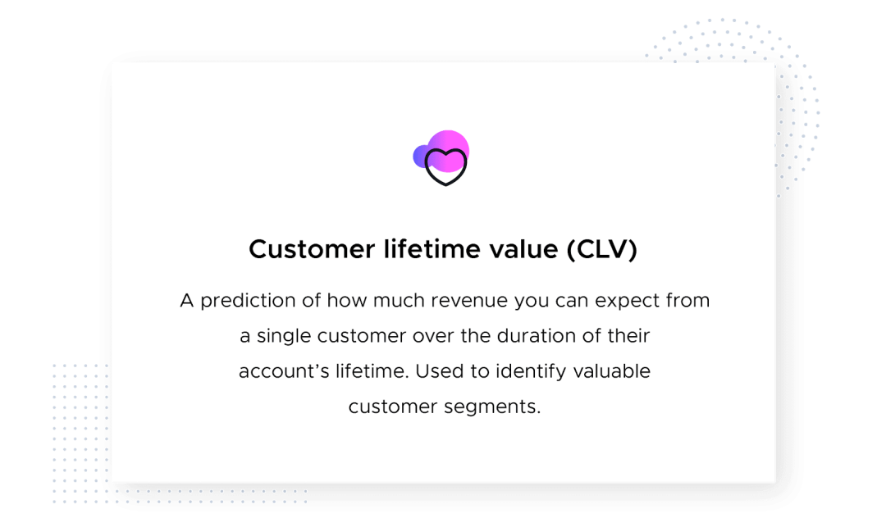

CLV 或 LTV 是在交易关系持续时间内，从单个客户获得的收入预测值。

### 6. 净流失 

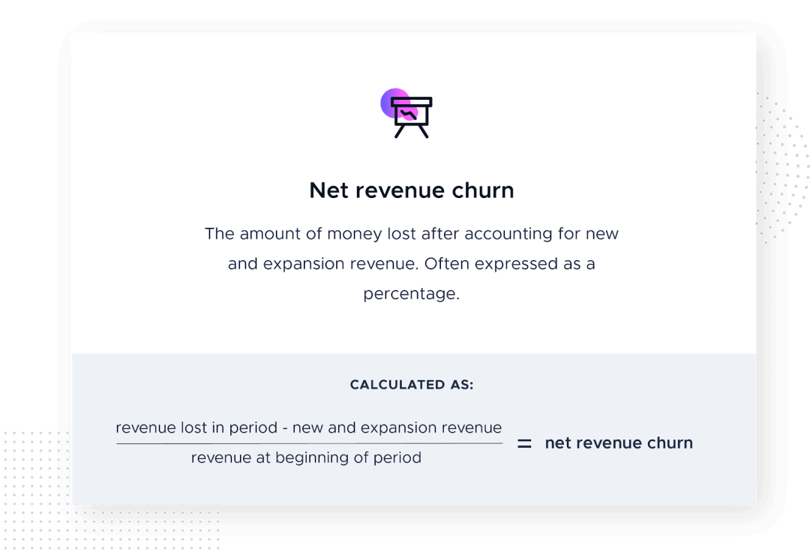 

### 7. 病毒式传播和网络效应

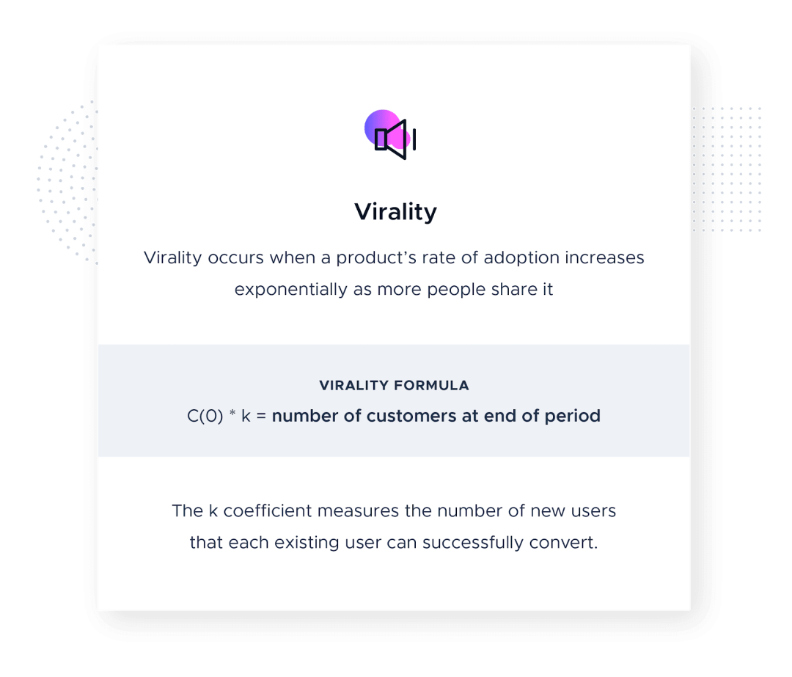

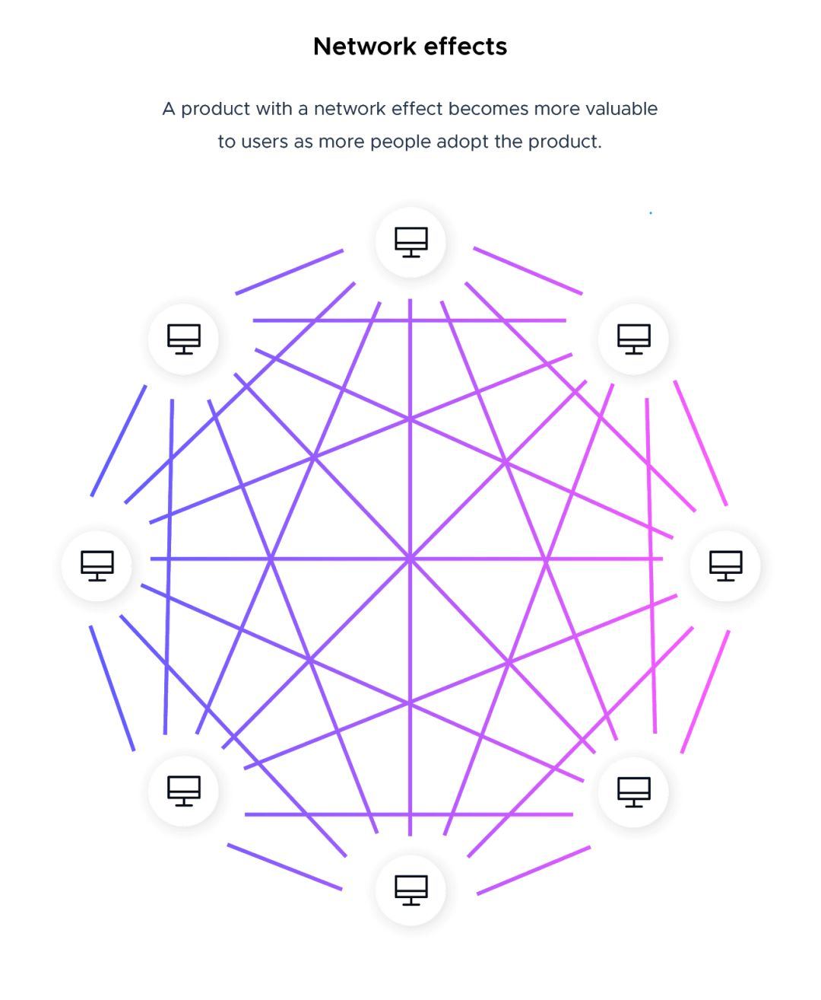

---
- [2B和2C和混合增长，SaaS增长的第二曲线](http://www.woshipm.com/operate/3589798.html)
- [SaaS增长的七个指标](http://www.360doc.com/content/20/0714/09/22849536_924132340.shtml)
- [SaaS 250](http://montclare.com/saas-250/)
- [展望中国SaaS 2021~2025 —— 长期增长下的机遇](https://36kr.com/p/1062252465131913)
- [颠覆SaaS（2.0版本）](https://xw.qq.com/cmsid/20210225A011AJ00)