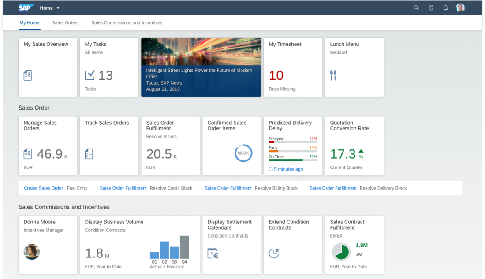
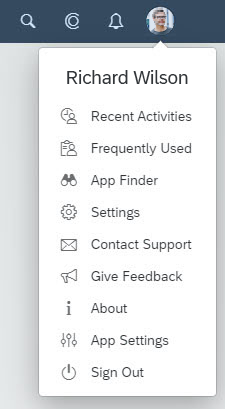
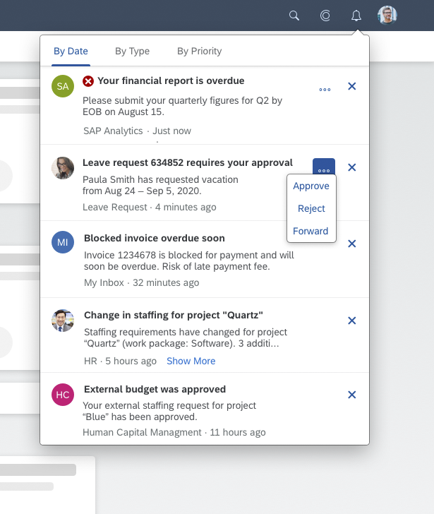

SAP Fiori Launchpad 是展示 SAP Fiori 应用，并且为 App 提供导航、个性化、内嵌支持和应用配置等服务的地方。

启动器是桌面和移动设备 SAP Fiori 应用的入口。启动器展示了一个包含磁铁的主页。每个磁铁都代表了一个用户能启动的业务程序。
 磁铁也能展示诸如打开任务数量的状态指示器。启动器时基于角色的，也就是说用户角色决定了那个磁贴显示.

## 主页 (Home Page)

主页是SAP Fiori 应哟启动器和中心进入点的核心。

页面包含用来启动应用和显示额外应用信息的磁贴。用户可以通过增加删除和分组磁贴来自定义主页。因为启动器是基于角色的，只有和当前
用户的角色档案相关联的应用才会显示。

## 控制室（Spaces）

控制室和它的页面为有用特定角色的用户组织最常用的应用。我们兼职只包含用户需要每天开始他们日常工作的信息和和应用。

启动器空间显示允许用户启动应用的磁贴。他们也显示一些额外的应用信息。用户可以通过增加和移除应用或者对他们进行分组来个性化他们的主页。
由于启动器是基于角色的，只有和用户角色档案相关的应用才会显示。

## 用户行为菜单 （User Actions Menu）

用户行为菜单提供了用户指定服务的一个范围。通过点击shell bar 右侧的图标或照片来访问它。用户行为菜单在所有的 SAP Fiori 应用都可用。

下面是不管当前什么环境都可以访问的以下选项：
- 通用设置
- 一个可访问应用的目录
- 用户最近访问的对象和应用
- 一个关于的弹窗，包含当前 SAP Fiori 启动器或应用的版本
- 一个用来退出启动器的登出选线

下面选项由当前环境决定：
- 在启动器主页，用户行为菜单包含一个用来定制主页内容的`编辑主页`的特性
- 一些应用，用户行为菜单可能也提供应用特定的设定

另外，客户可以激活联系支持团队和给出反馈的额外选项。

## 通知（Notifications）

用户可以通过点击 shell bar 右侧的`通知` 按钮来访问通知。

通知列表显示了系统从工作流或者聊天通知等不同数据源生成的通知。通知可以划分优先级，相似的可以被组织成分组。
从通知消息里我们可以导航到对应的应用。依赖配制，通知也可以提供采取即时行动的按钮。

## 组件 (Components)

### Tile 磁贴

### App Finder 应用查找

应用查找器是一个向应用商店一样列出了用户可能使用的所有应用的接口。应用查找器代替了磁贴目录。

### Shell Bar

启动器 Shell Bar 一直在屏幕上方显示。它提供了访问诸如企业搜索、用户行为菜单、通知的跨应用功能。
它也包含了拥有更深入页面导航的页面标题，以及商标区域。只要用户打开应用，一个` 返回`按钮就会在 shell bar 的左边显示。

### Enterprise Search

可以访问所有应用和业务对象的搜索。

### Services

启动器提供了可以被应用开发团队使用的一组核心功能。比如启动器可以处理跨应用的所有导航，
并且提供了收集用户反馈和联系支持团队的控制。

---
- [SAP Fiori Launchpad](https://experience.sap.com/fiori-design-web/launchpad/#)
