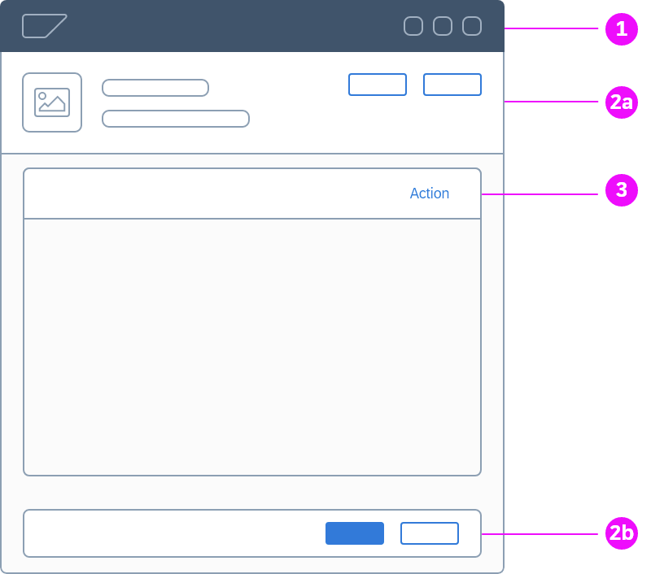

常规模式指所有应用要一贯使用的基本交互模式。简单的模式诸如数据导出，复杂的模式比如对象处理。

## Action Placement 放置动作

Action 触发比如保存或者删除业务对象的功能。也可以触发导航到一个action 能被执行、查看的不同的屏幕。
Action 显示为按钮。

放置动作到他们能操作的**信息附近**。比如，和业务对象关联的动作放到页面的上方，标识兑现改的动作放到标题附近。
任务流相关的动作放到页面底部，以便浏览完页面内容之后就能找到他们。

为了让动作更好的组织和找到，他们总是被放到**工具栏**。根据按钮影响的内容，有不同的工具栏。工具栏内的一些按钮
总是比另一些重要，我们通过排序这些按钮和应用不同的样式，来设置正确的焦点。

我们也可以当做内容一样在行内放置按钮。比如按钮用在表单里可以放在字段旁边，或者在表格行内。

动作必须和单纯的导航明确区分不同。导航功能经常放置在左侧，比如`首页`或者面包屑，而按钮则在工具栏右对齐。

## 组件
可选的 Toolbar 位置：

1. Shell 级别工具栏：包含影响整个应用或者整个当前用户环境的动作
1. Page 级别工具栏：包含影响整个页面或者和整个页面展现实体相关，比如业务对象、报表、流程等的动作，
页面级工具栏内容保持固定，不随着页面上的选择或者交互变化。页面级的工具栏可选的，如果没有动作那么就不显示。
如果工具栏可用，他们总是可见的，并且当用户滚动的时候他们保持在自己的位置。

---
- [General Patterns](https://experience.sap.com/fiori-design-web/general-patterns/)
