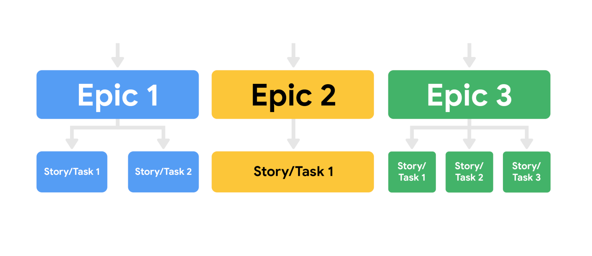

## define
User stories are short, simple descriptions of a deliverable 
told from the perspective of the user.

## function
Creating user stories helps the team develop a solution 
that is always centered around the user’s needs and overall experience. 

## User Stories

### Components should be included
- **User persona**. What is your user like? What is their relation to the project? 
  What goals do they have? 

- **Definition of Done**. This refers to an agreed upon set of items 
  that must be completed before a user story can be considered complete. 

- **Tasks**. What are the key activities needed to complete the user story?

- **Any feedback already provided**. If you are adding features 
  to an existing product and you have already received feedback 
  from customers on a past iteration, make sure to consider this feedback.
  
## I.N.V.E.S.T. 
User stories should meet the **I.N.V.E.S.T.** criteria:

- **Independent**: The story’s completion is not dependent on another story.
- **Negotiable**: There is room for discussion about this item.
- **Valuable**: Completing the user story has to deliver value. 
- **Estimable**: The Definition of Done must be clear so 
  that the team can give each user story an estimate. 
- **Small**: Each user story needs to be able to fit within a planned Sprint.
- **Testable**: A test can be conducted to check that it meets the criteria.

Format:

**As a <user role>, I want this <action> so that I can get this <value>.**

eg:

> As an avid reader, I want to be able to read reviews 
> before I check out a book from my local branch 
> so that I know I am getting a book I am interested in.

## Epics 

> to help manage related user stories.  `very large user story`

---
- https://www.coursera.org/learn/agile-project-management/supplement/ghOqA/the-components-of-user-stories-and-epics

