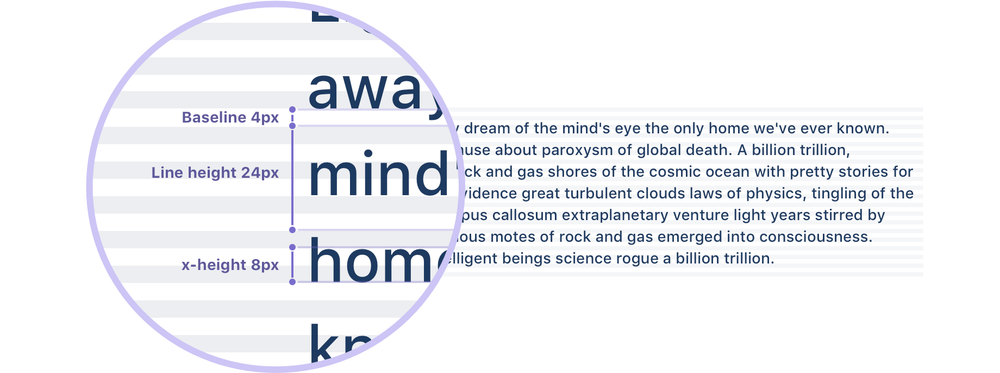
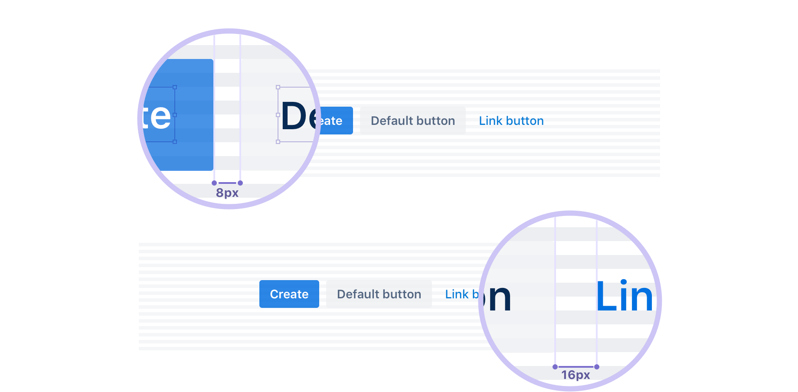
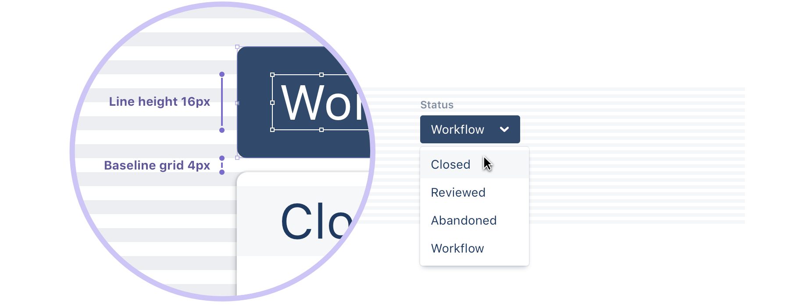
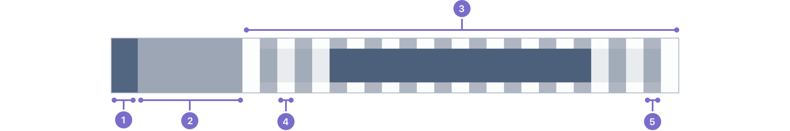
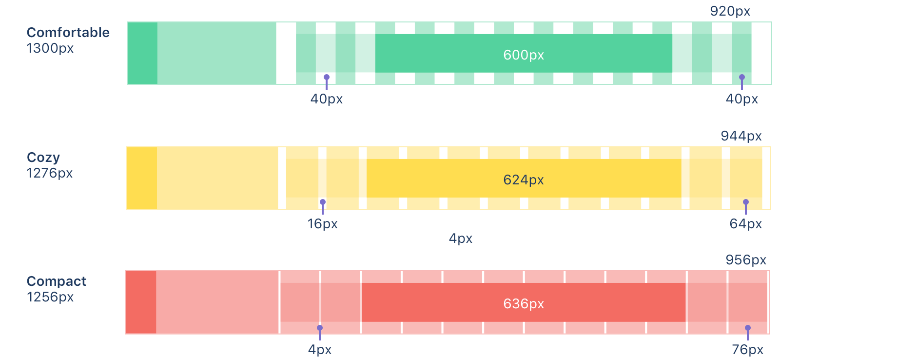
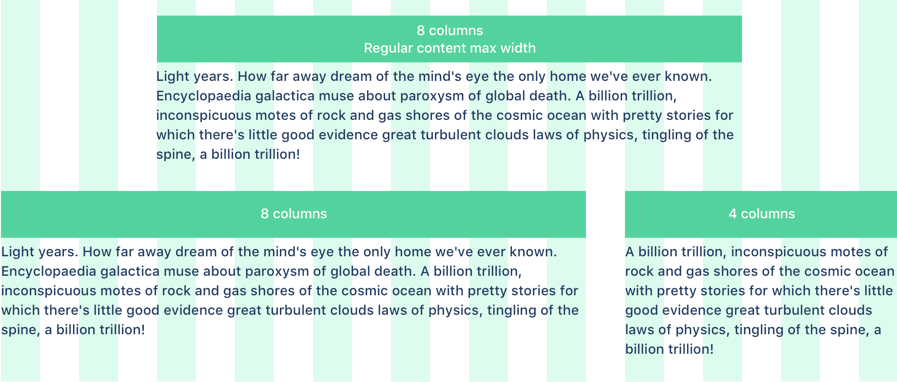

基于表格设计可以帮助创建无缝的、易于遵循的体验。

坚持使用 Grid 系统，提供了界面上布局元素和谐的、始终如一的基础。
基于表格设计可以创造一个有助于理解并能带来订单的体验。

栅格可以在 Atlaskit 的页面组件里面应用。

## Baseline grid and vertical rhythm

Atlassian 指定14px 作为基础字体大小，这样产生了 8px 的 x-height。
x-height 一半产生了 4px 的 baseline。 所有文本在垂直方向都遵循这个基线，
在所有页面创造了一个相似的韵律。这个韵律是通过行之间的行高和元素的margin 来创造的。

这个基线的约定自然引入了栅格系统的其它部分，包含图标、组件以及布局大小。
总是尝试在 8px 的栅格上放置对象，但是如果有必要就使用好的判断力将你的设计微调为 4px。
这个4px 的基线允许行高和小的调整有更多的灵活性。

### 最佳实践

- 使用 8px 的倍数去定义尺寸、空间以及定位元素
- 如必要使用 4px 来更精细的调整
- 尽可能保证对象水平和垂直对齐
- 将边框与网格对齐，而不是文本基线

## Layout with the horizontal grid

我们为要对齐的内容和 UI 元素定义一个水平网格， 创建了一个包含内容的视觉结构。
我们倾向于这一点而不是严重一览内容周周围的线和框，
因为它减少了用户需要顺序扫描的元素数量来小花他们看到的内容。
我们相信用户的内容应该是页面的主要焦点，所以我们减少所有不需要的分心。

1. **全局导航**：60px 的最小宽度
1. **内容导航**：240px 的最小宽度
1. **内容**：自适应宽度
1. **间隔**：列之间的固定宽度
1. **列**：内容对齐的指导

在我们的网格系统，我们在左边为导航预留出空间， 并且给内容应用一个居中对齐的12列自适应布局。
你可以应用一个固定的宽度或者一个流式的表格布局。固定宽度布局有一个最大960px 宽度，
对长表单内容很有用。流式布局全屏更适合对数据或者重交互的屏幕。

你可以合并固定或者流动布局下的多个快到一个屏幕上。
这在你想合并一短长格式文本与包含一个充满屏幕代码块时是有用的。

这两种布局都是自适应的。这意味着列宽会对导航展开与否做出反应，
而且列会根据屏幕实际占用的空间进行缩放。当屏幕是低于固定布局的最大宽度时，
两种网格类型实际上看起来一样。

### Gutter spacing

列之间的间隔有一个固定的宽度并且只有在字体缩放的时候才会缩放来保证
一个清晰和明显的内容分隔。为了允许不同类型的内容间距，有三个不同的内容尺寸：
compact, cozy, comfortable。

1. Compact: 列之间是最小的空格。
2. Cozy: (默认)列之间是正常的空格。
3. Comfortable: 列之间是最大的空格。

## Column layout and text

我们产品的布局通常是8或者12列的配置。
最简单的布局是在中心有一个8列的单块。或者如果有主要和次要元素的需要，
布局可以被扩展使用余下的4列。

在 Atlassian 类型栈里使用默认的字体大小，
我们可以为了舒适的阅读体验来优化段落的最大宽度。
布局里有一个最大宽度集合来保证文本的行长度不超过每行100字的可阅读尺寸。
对于14像素，推荐的行长度落在8列上。除了代码这个特例，文本块不应该超过这个设置。

### 最佳实践

- 保持布局简单。基础布局考虑一个8列的单块，或者8列和四列的两块。
- 最大行长度应该横跨8列，也是所有内容累心格斗适宜的尺寸。对于普通文本不要超过这个尺寸。

---
- https://atlassian.design/foundations/grid/
